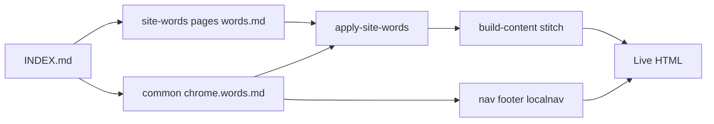

# Site-words source of truth — build-ready plan

**Status:** implemented (site-words live in build/deploy path)  
**Format lock (current):** humans edit `site-words/**/*.words.md` (`#` page / `##` label `{#id}` / plain text). YAML was a bootstrap seed only — do not reintroduce `.yaml` masters.  
**Repo:** `/home/yash/Projects Etc & aoo/aoo-static-gh`  
**Brand SoT (read before any new wording):** `/home/yash/Projects Etc & aoo/etc/docs/brand/startup-core.md`

This plan is a complete recipe. After approval, execute Phases 0 → 1 → 2 → 2.5 → 3 exactly. Do not weaken the dual format, skip pages, or leave wording masters as documentation-only after a page is marked complete.

---

## 1. North star

Create a **human- and AI-editable wording source of truth** so the founder can change customer-facing text without touching HTML/CSS/JS:

1. Edit the plain text under each `##` heading in `site-words/**/*.words.md` (leave `{#ids}` alone)
2. Save → commit → push / deploy
3. Live site updates — **no manual npm** for wording (deploy already runs `npm run build:site`)

**One page → one `.words.md` file** containing **all** user-facing text for that page. Shared chrome (nav / footer / guide localnav / shared CTA strips) lives only in `common/chrome.words.md`.

### Folder layout (create exactly)

```text
site-words/
  INDEX.md
  _schema.md
  common/
    chrome.words.md
  pages/
    shroffin/
      home.words.md
      explore-banks.words.md
      apply.words.md
      apply-contact.words.md
      about.words.md
    tools/
      project-approvals.words.md
      calculators.words.md
      calculators/
        emi.words.md
        how-much-loan.words.md
        loan-amount.words.md
        prepayment.words.md
        balance-transfer.words.md
        tenure.words.md
        tax-savings.words.md
    guide/
      overview.words.md
      documents.words.md
      tax-benefits.words.md
      concessions.words.md
      home-loan-insurance.words.md
      property-home-insurance.words.md
      credit-life-insurance.words.md
      complaints.words.md
    company/
      privacy-policy.words.md
      terms-of-use.words.md
      sitemap.words.md
```

**Count check:** `common/chrome.words.md` + **25** page `.words.md` files = full inventory (matches `data/content-pages.json` outputs + shared chrome).



---

## 2. Dual slot shape (locked)

Every wording file must be **100% AI-native** and **100% human-easiest**. If a choice helps AI but hurts human editing (or the reverse), reject it.

`slots` is an **ordered list** (page scroll order). Each entry:

| Field | Who | Rule |
|---|---|---|
| `id` | AI + build | Required. Dot path. Unique on the page. Never casual rename. |
| `where` | Human (+ AI orientation) | Required. One plain-English location line. |
| `text` | **Human edits this** | Required for normal strings. Full wording as shown (or spoken for aria). |
| `highlight` | Build only | Optional list of substrings already present in `text`. |
| `type` | AI + build | Optional: `list` \| `template` \| `external_link` \| `internal_link`. Default = plain text. |
| `items` / `pattern` / `placeholders` / `label`+`href` | When `type` set | Structured payload; **no HTML** in values. |

### Locked entry shape

```yaml
- id: hero.title
  where: "Top of Home — big headline"
  text: |
    A fair way to choose
    your home loan bank.
  highlight: ["fair"]
```

**Forbidden:** splitting one sentence into `*_before` / `*_after` as the primary edit surface; bare `key: "value"` maps with no `where`; HTML/CSS inside `text`; requiring humans to understand injector tokens day-to-day.

**Marker in templates (build only):** `{{SW:slot.id}}` — e.g. `{{SW:hero.title}}`. Humans never edit markers; they edit YAML `text:`.

---

## 3. Include-everything vs data-file exclusion

**Fail closed — include everything by default.**

Put **all** customer-facing wording in site-words YAML:

- Headings, body prose, buttons/CTAs, labels, placeholders, tooltips, dropdown options
- Filter sections/chips/notes, table column headers, side-panel titles/notes
- Calculation/results panel labels, flip card front/back, in-page indexes
- Empty/error/helper states, user-facing aria / visually-hidden meaning
- SEO document title + meta description
- Gated/commented customer copy → `slots_gated` (exact text kept, not deleted)

**Only exclusion:** strings whose *value is produced from or is itself a data-file field* — rates, fees, eligibility numbers, bank product rows, contact phone/email/WhatsApp digits, anything that changes when the data file changes.

| On screen | Where it lives |
|---|---|
| Column header “EMI” | YAML |
| Tooltip under that column | YAML |
| Cell value `8.45%` from compare JSON | data file |
| Phone from `data/site-contacts.json` | data file |
| “{bank} shows a lower rate…” | YAML `type: template`; `{bank}` filled from data |

**Test:** If you swapped the data file for different banks/numbers, would this exact label still appear? → **YAML.** If the characters *are* the data → **data file.**

When unsure → put it in YAML and note doubt in `_meta.notes_for_ai`. Do not omit “because it’s in JS.”

**Out of scope for site-words files:** education-loan / legacy `css/style.css` pages, `pages/_*.html` prototypes; raw product/contact **values** in data JSON.

---

## 4. Full page inventory

### Shared chrome

| YAML | Owns | Must scan |
|---|---|---|
| `common/chrome.yaml` | Global nav labels, footer labels, theme control aria, guide localnav labels, help-strip / prefooter CTA strings currently hardcoded in `scripts/lib/site-chrome.js` | `partials/global-nav.html`, `partials/site-footer.html`, `partials/guide-localnav.html`, `scripts/lib/site-chrome.js` |

Does **not** own contact numbers (`data/site-contacts.json`).

### Content-factory pages (25)

| # | YAML file | Live path | Body today | Layout today |
|---|---|---|---|---|
| 1 | `home.yaml` | `index.html` | `content/pages/home.body.html` | `templates/layouts/home.html` |
| 2 | `explore-banks.yaml` | `pages/explore-banks.html` | `content/pages/explore-banks.body.html` | `templates/layouts/explore-banks.html` |
| 3 | `apply.yaml` | `pages/apply.html` | `content/pages/apply.body.html` | `templates/layouts/apply.html` |
| 4 | `apply-contact.yaml` | `pages/apply-contact.html` | `content/pages/apply-contact.body.html` | `templates/layouts/apply-contact.html` |
| 5 | `project-approvals.yaml` | `pages/project-approvals.html` | `content/pages/project-approvals.body.html` | `templates/layouts/project-approvals.html` |
| 6 | `calculators.yaml` | `pages/calculators.html` | `content/pages/calculators.body.html` | `templates/layouts/calculators.html` |
| 7 | `calculators-emi.yaml` | `pages/calculators/emi.html` | `content/pages/calculators-emi.body.html` | `templates/layouts/calculators-emi.html` |
| 8 | `calculators-how-much-loan.yaml` | `pages/calculators/how-much-loan.html` | `content/pages/calculators-how-much-loan.body.html` | `templates/layouts/calculators-how-much-loan.html` |
| 9 | `calculators-loan-amount.yaml` | `pages/calculators/loan-amount.html` | `content/pages/calculators-loan-amount.body.html` | `templates/layouts/calculators-loan-amount.html` |
| 10 | `calculators-prepayment.yaml` | `pages/calculators/prepayment.html` | `content/pages/calculators-prepayment.body.html` | `templates/layouts/calculators-prepayment.html` |
| 11 | `calculators-balance-transfer.yaml` | `pages/calculators/balance-transfer.html` | `content/pages/calculators-balance-transfer.body.html` | `templates/layouts/calculators-balance-transfer.html` |
| 12 | `calculators-tenure.yaml` | `pages/calculators/tenure.html` | `content/pages/calculators-tenure.body.html` | `templates/layouts/calculators-tenure.html` |
| 13 | `calculators-tax-savings.yaml` | `pages/calculators/tax-savings.html` | `content/pages/calculators-tax-savings.body.html` | `templates/layouts/calculators-tax-savings.html` |
| 14 | `guide-overview.yaml` | `pages/guide.html` | `content/guide/overview.body.html` | `templates/layouts/guide-overview.html` |
| 15 | `guide-documents.yaml` | `pages/guide-documents.html` | `content/guide/documents.body.html` | `templates/layouts/guide-documents.html` |
| 16 | `guide-tax-benefits.yaml` | `pages/tax-benefits.html` | `content/guide/tax-benefits.body.html` | `templates/layouts/guide-tax-benefits.html` |
| 17 | `guide-concessions.yaml` | `pages/concessions.html` | `content/guide/concessions.body.html` | `templates/layouts/guide-concessions.html` |
| 18 | `guide-home-loan-insurance.yaml` | `pages/home-loan-insurance.html` | `content/guide/home-loan-insurance.body.html` | `templates/layouts/guide-home-loan-insurance.html` |
| 19 | `guide-property-home-insurance.yaml` | `pages/property-home-insurance.html` | `content/guide/property-home-insurance.body.html` | `templates/layouts/guide-property-home-insurance.html` |
| 20 | `guide-credit-life-insurance.yaml` | `pages/credit-life-insurance.html` | `content/guide/credit-life-insurance.body.html` | `templates/layouts/guide-credit-life-insurance.html` |
| 21 | `guide-complaints.yaml` | `pages/home-loan-complaints.html` | `content/guide/complaints.body.html` | `templates/layouts/guide-complaints.html` |
| 22 | `about.yaml` | `pages/about.html` | `content/pages/about.body.html` | `templates/layouts/about.html` |
| 23 | `legal-privacy-policy.yaml` | `privacy-policy.html` | `content/legal/privacy-policy.body.html` | `templates/layouts/legal-privacy.html` |
| 24 | `legal-terms-of-use.yaml` | `terms-of-use.html` | `content/legal/terms-of-use.body.html` | `templates/layouts/legal-terms.html` |
| 25 | `sitemap.yaml` | `sitemap.html` | `content/pages/sitemap.body.html` | `templates/layouts/sitemap.html` |

### Page-specific hunt notes

| Page | Must include |
|---|---|
| **explore-banks** | Hero title; full inputs card (labels, tooltips, dropdowns, Compare CTA); card-load footnote as `type: template`; filters + option notes; every table col header + COLUMN_HELP; side panels; calc labels; empty/error. Sources: body + `src/home-loan-compare.js` + `src/hlc-intelligence.js`. |
| **calculators*** | Hub + each of 7: every input label, result panel label, table header/row label, notes, errors, SEO. Digits that are live calculations stay out of YAML. Also scan `js/shroffin-calculators.js`. |
| **guide-*** (all 8) | Hero, chapter index, sections, flip front/back, intelligence bullets, CTAs, external-link labels, notes, SEO. Insurance children are **separate complete files**. Localnav → chrome only. |
| **about** | Full live copy + **`slots_gated`** for ABOUT_OUR_ROOTS / “Our roots” and related gated blocks (exact text kept). |
| **legal-*** | Tie YAML to **live** `content/legal/*.body.html` until etc markdown render parity exists. |
| **Tools gate** | Project Bank Finder + hub + all 7 calcs must be `_coverage.status: complete` before Tools is “done.” |
| **Guide gate** | All 8 guide YAMLs complete; skipping an insurance child fails the job. |

### Key naming (mandatory)

| UI kind | Pattern | Example |
|---|---|---|
| Page hero | `hero.*` | `hero.title` |
| Section | `section.<id>.*` | `section.emi.heading` |
| Form field | `form.<field>.*` | `form.cibil.label` |
| Filter | `filter.section.<id>.*` / `filter.chip.<id>` | `filter.action.clear` |
| Table col | `table.col.<key>.label` + `.tooltip` | `table.col.emi.label` |
| Calc panel | `calc.panel.<metric>.*` | `calc.panel.emi.label` |
| Calc table | `calc.table.<id>.col.<key>` / `.row.<key>` | — |
| Flip card | `card.<id>.front.*` / `.back.*` | — |
| Empty/error | `state.empty.*` / `state.error.*` | — |
| SEO | under `seo:` | not inside `slots` |
| Gated | `slots_gated` list | same entry shape |

---

## 5. Worked example — `home.yaml` (dual format, abbreviated)

**File:** `site-words/pages/home.yaml`

```yaml
# ============================================================
# HOME — all customer-facing words for index.html
# YOU EDIT: the "text:" lines
# LEAVE ALONE: id (unless changing the system with an engineer)
# Nav/footer → ../common/chrome.yaml
# ============================================================

page:
  id: home
  title_for_humans: Home
  live_path: index.html
  live_url: /
  body_master_today: content/pages/home.body.html
  layout_today: templates/layouts/home.html

_meta:
  audience: customer
  edit_rule: "Humans change text (and where). AI must not rename id without schema+injector update."
  human_howto: "Change text: → save → commit → push. Deploy rebuilds the site automatically. No manual npm for wording."
  locked_claims:
    - "Independent transparent banking — compare all banks, apply in one click."
  notes_for_ai: |
    Ordered slots list. Prefer full text + highlight[]. Demo iframe titles are a11y copy.

_coverage:
  status: complete
  inventoried_at: YYYY-MM-DD
  sources_scanned:
    - content/pages/home.body.html
    - templates/layouts/home.html
  checklist:
    headings: true
    body_prose: true
    buttons_ctas: true
    page_hero_title: true
    labels: true
    placeholders: true
    tooltips_field_help: true
    tooltips_column_help: true
    dropdown_options: true
    filter_sections: true
    table_column_headers: true
    side_panels: true
    side_panel_notes: true
    calculation_panel_labels: true
    calculator_table_headers: true
    calculator_table_row_labels: true
    inputs_card: true
    card_load_footnote: true
    filter_option_notes: true
    flip_cards_front: true
    flip_cards_back: true
    in_page_index: true
    notes_disclaimers: true
    cards: true
    empty_error_helper_states: true
    aria_labels_user_facing: true
    seo_title_description: true
    gated_or_commented_copy: true
  omitted_by_policy:
    - "Shared nav/footer → common/chrome.yaml"
    - "Bank logo image paths (assets, not copy)"

seo:
  document_title: "Shroffin"
  meta_description: ""

slots:
  # --- Hero ---
  - id: hero.title
    where: "Top of Home — big headline"
    text: |
      A fair way to choose
      your home loan bank.
    highlight: ["fair"]

  - id: hero.cta_primary
    where: "Top of Home — main button"
    text: "Explore banks"

  # --- Story: Compare ---
  - id: story.compare.title
    where: "Home story — first feature headline"
    text: |
      Your home loan journey,
      now completely re-engineered.
    highlight: ["completely re-engineered"]

  - id: story.compare.body
    where: "Home story — first feature paragraph"
    text: |
      Lender details that were scattered are now in one place,
      so you can compare them side by side.

  # --- Story: Apply Only Once ---
  - id: story.apply.title
    where: "Home story — apply once headline"
    text: "Now, Apply Only Once."
    highlight: ["Apply Only Once"]

  - id: story.apply.body
    where: "Home story — apply once paragraph"
    text: "Send one application to every bank you chose and let them compete for you."

slots_gated: []
```

### How the founder reads this

| You see | You do |
|---|---|
| `# --- Hero ---` | Section of the page |
| `where:` | Which bit on the page |
| `text:` | **Change this** |
| `id:` / `highlight:` | Leave alone |

Same header + ordered `slots` on every other page file.

---

## 6. Founder path (zero friction)

1. Open `site-words/INDEX.md` → open the page YAML (e.g. Home).
2. Find the block; edit only `text:`.
3. **Save.**
4. **Commit + push** (or run the existing deploy command).
5. Wait for deploy: live site shows the new word.

**No npm required from the founder for wording.**

`scripts/deploy.ps1` already runs:

```powershell
npm run build:site
npm run lint:responsive
```

Once site-words apply is wired into `build:site`, push/deploy picks up wording automatically.

Saving alone updates the file on the computer. **Push / deploy** is what updates shroffin.com.

---

## 7. Architecture

### Markers

Place `{{SW:<slot.id>}}` in:

- `content/**/*.body.html` — body copy
- `partials/*.html` — chrome labels (nav, footer, guide-localnav) where those strings are owned by chrome YAML
- `templates/layouts/*.html` — SEO `<title>` / meta description (and any layout-owned strings)

Example body fragment:

```html
<h1 class="home-hero-title">{{SW:hero.title}}</h1>
<a class="home-hero-cta home-hero-cta-primary" href="/pages/explore-banks.html">{{SW:hero.cta_primary}}</a>
```

Optional highlight: injector may wrap substrings listed in `highlight` with the existing highlight markup for that page (parity with today’s styled words). Default first implementation: replace marker with escaped plain text; add highlight wrapping only where current HTML already styles those words (home story/hero). Document the exact wrap helper in `_schema.md` when implemented.

### Library — `scripts/lib/site-words.js`

Responsibilities:

- Load YAML via the existing `yaml` package (`devDependencies` already includes `"yaml": "^2.9.0"` — **no new install required** unless version drift; verify with `npm ls yaml`)
- Validate: required fields, unique `id`s, known `type`s, `highlight` substrings ⊆ `text`
- Build `slotsById` map from ordered `slots` (+ optional merge of chrome slots for chrome apply)
- `applyMarkers(html, slotsById)` — replace every `{{SW:…}}`

### Apply script — `scripts/apply-site-words.js`

- CLI: default write; `--check` fails if any target still has unresolved `{{SW:` after dry-run, or if YAML invalid
- For each content-pages entry: load page YAML → apply markers to body (and layout SEO strings before/during stitch)
- For chrome: load `common/chrome.yaml` → apply markers inside partials **or** resolve chrome slots inside `site-chrome.js` render strings (prefer: markers in partials + apply before sync; keep one path)

### Wire into existing builds

| Hook | Change |
|---|---|
| `scripts/build-content.js` | Before stitch: read body (+ layout if needed) through `applyMarkers` using that page’s YAML (+ SEO from `seo:` into layout markers). |
| `scripts/sync-site-nav.js` / `sync-site-footer.js` / `sync-guide-localnav.js` / `lib/site-chrome.js` | Ensure chrome label sources go through chrome YAML (markers in partials applied before fill, or strings read from YAML in `site-chrome.js`). |
| `package.json` `build:site` | Must include site-words apply so deploy picks up wording. Prefer: apply runs **inside** `build:content` and chrome sync (so one `build:site` is enough). Also expose explicit script. |
| Explore / calculators JS | When a page is complete: generate or inline words JSON from the same YAML during `build:compare` / calculator build — **no hand-maintained duplicate string tables**. Phase 2 wire for those pages must include this. |

### npm scripts to add

```json
"apply:site-words": "node scripts/apply-site-words.js",
"check:site-words": "node scripts/check-site-words.js"
```

**`build:site` must include apply.** Exact target line (edit `package.json`):

```json
"build:site": "npm run sync:legal-content && npm run build:contacts && npm run build:compare && npm run build:guide-intelligence && npm run build:content -- --write && npm run build:sitemap -- --write && npm run build:nav && npm run build:footer && npm run build:theme-boot && npm run build:guide-localnav"
```

If apply is **embedded inside** `build-content.js` and chrome sync (recommended), the line above stays structurally the same and still picks up wording. If apply is a **separate** step, insert it before content/chrome write:

```json
"build:site": "npm run sync:legal-content && npm run build:contacts && npm run build:compare && npm run build:guide-intelligence && npm run apply:site-words && npm run build:content -- --write && npm run build:sitemap -- --write && npm run build:nav && npm run build:footer && npm run build:theme-boot && npm run build:guide-localnav"
```

**Recommended ownership:** call `applyMarkers` from `build-content.js` stitch path and from chrome sync/lib so markers never ship live; keep `apply:site-words` as an optional explicit re-apply for debugging.

### `lint:responsive`

Add `npm run check:site-words` into the existing `lint:responsive` chain (after content checks or near other check:* scripts) so deploy’s lint catches broken YAML.

Forbidden: leaving HTML as SoT while YAML is “docs only” after `_coverage.status: complete`.

---

## 8. Phases (exact commands)

Repo root for every command:

```bash
cd "/home/yash/Projects Etc & aoo/aoo-static-gh"
```

### Phase 0 — Scaffold (no live string moves yet)

```bash
cd "/home/yash/Projects Etc & aoo/aoo-static-gh"
mkdir -p site-words/common site-words/pages
```

Create:

1. `site-words/_schema.md` — edit rules, key naming table, build commands, coverage checklist, out-of-scope, mapping table (`page id` → YAML → body → layout)
2. `site-words/INDEX.md` — clickable relative links; groups: Shroffin / Tools (PBF + hub + 7 calcs) / Guide (all 8) / Company / Site Map / Shared; top line: edit wording here, then push/deploy (see `_schema.md`)
3. `site-words/common/chrome.yaml` — shell with `page` / `_meta` / `slots: []`
4. Stub each of the 25 page YAMLs with `page` header + empty `slots: []` + `_coverage.status: in_progress`

Paste-ready chrome shell:

```yaml
page:
  id: chrome
  title_for_humans: Shared chrome (nav, footer, guide localnav)
  live_path: partials/
  live_url: "(every redesigned page)"
  body_master_today: partials/global-nav.html
  layout_today: "(n/a — partials + site-chrome.js)"

_meta:
  audience: customer
  edit_rule: "Humans change text/where. AI must not rename id without schema+injector update."
  notes_for_ai: |
    Shared only. Do not duplicate these strings into page YAMLs.

_coverage:
  status: in_progress
  inventoried_at: ""
  sources_scanned: []
  checklist:
    buttons_ctas: false
    labels: false
    aria_labels_user_facing: false
    seo_title_description: false
  omitted_by_policy:
    - "Contact phone/email/WhatsApp values from data/site-contacts.json"

seo:
  document_title: ""
  meta_description: ""

slots: []
```

**Verify Phase 0:**

```bash
cd "/home/yash/Projects Etc & aoo/aoo-static-gh"
test -f site-words/INDEX.md && test -f site-words/_schema.md && test -f site-words/common/chrome.yaml
ls site-words/pages | wc -l
# expect: 25
```

### Phase 1 — Extract chrome to 100% coverage

1. Inventory every user-facing string in nav, footer, guide-localnav, and `site-chrome.js` CTA/help-strip strings.
2. Fill `common/chrome.yaml` → `_coverage.status: complete`.
3. Update INDEX “Shared” section.
4. Do **not** change live HTML until Phase 2 chrome wire in the same sitting as first page wire — or wire chrome immediately after extract in one commit that preserves golden parity.

**Verify Phase 1 (after wire):**

```bash
cd "/home/yash/Projects Etc & aoo/aoo-static-gh"
# after injector exists:
npm run build:nav && npm run build:footer && npm run build:guide-localnav
# change one chrome.yaml text: label, rebuild, confirm all redesigned pages show it
```

### Phase 2 — Per-page loop (strict order)

Exact order:

1. home  
2. explore-banks  
3. apply  
4. apply-contact  
5. project-approvals *(Tool — Project Bank Finder)*  
6. calculators *(hub)*  
7. calculators-emi  
8. calculators-how-much-loan  
9. calculators-loan-amount  
10. calculators-prepayment  
11. calculators-balance-transfer  
12. calculators-tenure  
13. calculators-tax-savings  

**Tools gate:** cannot mark Tools done until PBF + hub + all 7 calcs have `_coverage.status: complete` (every table label included).

14. guide-overview  
15. guide-documents  
16. guide-tax-benefits  
17. guide-concessions  
18. guide-home-loan-insurance *(Insurance parent)*  
19. guide-property-home-insurance *(Insurance child)*  
20. guide-credit-life-insurance *(Insurance child)*  
21. guide-complaints  

**Guide gate:** all 8 complete; skipping an insurance child fails the job.

22. about *(+ `slots_gated`)*  
23. legal-privacy-policy  
24. legal-terms-of-use  
25. sitemap  

**Each page iteration:**

**A. Inventory** — scan all sources; list every user-facing string.  
**B. Extract** — write complete YAML (`_coverage.status: complete`). Copy **existing** live text first (no silent rewrites). Read startup-core before any *new* wording.  
**C. Wire** — replace live strings with `{{SW:id}}` in body/layout/partials/JS word sources; YAML becomes SoT. Preserve golden `<main>` parity.  
**D. Verify:**

```bash
cd "/home/yash/Projects Etc & aoo/aoo-static-gh"
npm run build:content -- --write
# page-relevant extras, e.g. explore:
npm run build:compare
npm run build:nav && npm run build:footer && npm run build:guide-localnav
npm run build:content -- --check
# if goldens must update after intentional SoT move (output matches prior visible wording):
# npm run bless:content -- --only=<id>
```

**E.** Change one YAML `text:` → rebuild → confirm that page updates; structure unchanged.  
**F.** Update INDEX + schema mapping row.  
**G.** Only then advance to the next page.

**First implementation sitting (home + injector):** also create `scripts/lib/site-words.js`, `scripts/apply-site-words.js`, `scripts/check-site-words.js`, and package.json scripts (see §7 and §9).

### Phase 2.5 — Push → live (founder zero-friction)

1. Confirm `npm run build:site` always applies site-words before publishing HTML (embedded or explicit `apply:site-words` in the chain).
2. Confirm `scripts/deploy.ps1` still calls `npm run build:site` (already true — lines run `npm run build:site` then `npm run lint:responsive`).
3. Update `docs/HOW_TO_EDIT_SITE_WORDS.md` founder loop to:

```markdown
1. Edit `site-words/pages/….yaml` (`text:` only)
2. Save
3. Commit + push (or `npm run deploy`)
4. Live site shows the new word — no manual npm for wording
```

4. Optional hardening: ensure CI / deploy fails on `check:site-words` (via `lint:responsive`).
5. **Verify once:**

```bash
cd "/home/yash/Projects Etc & aoo/aoo-static-gh"
# 1) Edit one Home text: word in site-words/pages/home.yaml
# 2) Run real deploy path:
npm run build:site
npm run lint:responsive
# 3) Confirm local built index.html contains the new word
# 4) On next push/deploy, confirm shroffin.com (or staging) shows it
```

### Phase 3 — Docs + regression

1. Update `docs/CONTENT_SOURCE_OF_TRUTH.md` — site page words master = `site-words/` (bodies hold markers; YAML owns strings).
2. Update `docs/HOW_TO_EDIT_SITE_WORDS.md` as in Phase 2.5.
3. Ensure `check:site-words` fails on: missing YAML for a content-pages entry; `_coverage.status` != complete; unknown slot types; duplicate ids; unresolved `{{SW:` in built HTML when `--check` on apply.
4. Full suite:

```bash
cd "/home/yash/Projects Etc & aoo/aoo-static-gh"
npm run check:site-words
npm run build:site
npm run lint:responsive
```

---

## 9. Paste-ready code skeletons

### `scripts/lib/site-words.js`

```js
'use strict';

const fs = require('fs');
const path = require('path');
const YAML = require('yaml');

const root = path.resolve(__dirname, '../..');
const SITE_WORDS = path.join(root, 'site-words');
const MARKER_RE = /\{\{SW:([a-z0-9_.-]+)\}\}/gi;

const KNOWN_TYPES = new Set([
  '',
  'list',
  'template',
  'external_link',
  'internal_link'
]);

function loadYamlFile(absPath) {
  const raw = fs.readFileSync(absPath, 'utf8');
  return YAML.parse(raw);
}

function slotsToMap(slots, fileLabel) {
  const map = Object.create(null);
  if (!Array.isArray(slots)) {
    throw new Error(fileLabel + ': slots must be an ordered list');
  }
  slots.forEach(function (entry, i) {
    if (!entry || typeof entry !== 'object') {
      throw new Error(fileLabel + ': slots[' + i + '] invalid');
    }
    if (!entry.id || typeof entry.id !== 'string') {
      throw new Error(fileLabel + ': slots[' + i + '] missing id');
    }
    if (!entry.where || typeof entry.where !== 'string') {
      throw new Error(fileLabel + ': slots[' + i + '] (' + entry.id + ') missing where');
    }
    const type = entry.type || '';
    if (!KNOWN_TYPES.has(type)) {
      throw new Error(fileLabel + ': slots[' + i + '] (' + entry.id + ') unknown type ' + type);
    }
    if (type === '' || type === 'template' || type === 'external_link' || type === 'internal_link') {
      if (typeof entry.text !== 'string') {
        throw new Error(fileLabel + ': slots[' + i + '] (' + entry.id + ') missing text');
      }
    }
    if (map[entry.id]) {
      throw new Error(fileLabel + ': duplicate id ' + entry.id);
    }
    if (Array.isArray(entry.highlight)) {
      entry.highlight.forEach(function (h) {
        if (typeof entry.text === 'string' && entry.text.indexOf(h) === -1) {
          throw new Error(
            fileLabel + ': highlight "' + h + '" not found in text for ' + entry.id
          );
        }
      });
    }
    map[entry.id] = entry;
  });
  return map;
}

function loadPageWords(yamlRel) {
  const abs = path.join(root, yamlRel);
  const doc = loadYamlFile(abs);
  const slotsById = slotsToMap(doc.slots || [], yamlRel);
  const gatedById = slotsToMap(doc.slots_gated || [], yamlRel + '#slots_gated');
  return { doc: doc, slotsById: slotsById, gatedById: gatedById };
}

function loadChromeWords() {
  return loadPageWords('site-words/common/chrome.yaml');
}

/**
 * Replace {{SW:slot.id}} markers. Unknown markers throw (fail closed).
 * Plain text is HTML-escaped. list/template/link types: use text or join items
 * as documented in _schema.md (extend carefully; keep parity).
 */
function applyMarkers(html, slotsById) {
  return html.replace(MARKER_RE, function (_m, id) {
    const entry = slotsById[id];
    if (!entry) {
      throw new Error('Unknown site-words marker {{SW:' + id + '}}');
    }
    if (entry.type === 'list') {
      // Build-time list expansion belongs in a dedicated helper; for skeleton,
      // require a pre-rendered text field or throw until helper ships.
      if (typeof entry.text === 'string') return escapeHtml(entry.text);
      throw new Error('list slot ' + id + ' needs applyList helper — see _schema.md');
    }
    let out = entry.text;
    if (Array.isArray(entry.highlight) && entry.highlight.length) {
      out = applyHighlights(out, entry.highlight);
      return out; // highlight helper returns safe HTML fragments matching site pattern
    }
    return escapeHtml(out);
  });
}

function escapeHtml(s) {
  return String(s)
    .replace(/&/g, '&amp;')
    .replace(/</g, '&lt;')
    .replace(/>/g, '&gt;')
    .replace(/"/g, '&quot;');
}

/** Placeholder — replace with the page’s real highlight span class during wire. */
function applyHighlights(text, highlights) {
  let out = escapeHtml(text);
  highlights.forEach(function (h) {
    const safe = escapeHtml(h);
    out = out.split(safe).join('<span class="sw-highlight">' + safe + '</span>');
  });
  return out;
}

function findUnresolvedMarkers(html) {
  const found = [];
  let m;
  const re = /\{\{SW:([a-z0-9_.-]+)\}\}/gi;
  while ((m = re.exec(html)) !== null) found.push(m[1]);
  return found;
}

module.exports = {
  SITE_WORDS: SITE_WORDS,
  loadYamlFile: loadYamlFile,
  loadPageWords: loadPageWords,
  loadChromeWords: loadChromeWords,
  slotsToMap: slotsToMap,
  applyMarkers: applyMarkers,
  findUnresolvedMarkers: findUnresolvedMarkers,
  escapeHtml: escapeHtml
};
```

### Wire sketch in `scripts/build-content.js`

Inside `stitch` (concept — adapt to file):

```js
const { loadPageWords, applyMarkers } = require('./lib/site-words');

function stitch(layoutRel, bodyRel, outRel, wordsYamlRel) {
  const layoutRaw = fs.readFileSync(path.join(root, layoutRel), 'utf8');
  const bodyRaw = fs.readFileSync(path.join(root, bodyRel), 'utf8');
  const { doc, slotsById } = loadPageWords(wordsYamlRel);
  // Optional: inject seo.document_title / seo.meta_description into layout markers
  // e.g. {{SW:seo.document_title}} mapped from doc.seo — or dedicated replace.
  const layout = applyMarkers(layoutRaw, slotsByIdWithSeo(slotsById, doc.seo));
  const body = applyMarkers(bodyRaw, slotsById);
  if (!layout.includes('{{BODY_HTML}}')) {
    throw new Error(layoutRel + ' missing {{BODY_HTML}}');
  }
  return applySiteChrome(layout.replace('{{BODY_HTML}}', body), outRel);
}
```

Add a `site_words` (or derive path as `site-words/pages/<id>.yaml`) field to `data/content-pages.json` **or** a single mapping module `scripts/lib/site-words-map.js` listing `content-pages id → yaml path`. Prefer one map module to avoid duplicating output paths.

### `scripts/apply-site-words.js` (outline)

```js
'use strict';

const fs = require('fs');
const path = require('path');
const {
  loadPageWords,
  loadChromeWords,
  applyMarkers,
  findUnresolvedMarkers
} = require('./lib/site-words');
const { yamlPathForContentEntry } = require('./lib/site-words-map');

const root = path.resolve(__dirname, '..');
const checkOnly = process.argv.includes('--check');
const pages = JSON.parse(
  fs.readFileSync(path.join(root, 'data', 'content-pages.json'), 'utf8')
);

function applyFile(rel, slotsById) {
  const abs = path.join(root, rel);
  const src = fs.readFileSync(abs, 'utf8');
  if (!/\{\{SW:/.test(src)) return false;
  const next = applyMarkers(src, slotsById);
  const left = findUnresolvedMarkers(next);
  if (left.length) {
    throw new Error(rel + ' unresolved markers: ' + left.join(', '));
  }
  if (!checkOnly && next !== src) fs.writeFileSync(abs, next);
  return next !== src;
}

// Chrome partials
const chrome = loadChromeWords();
['partials/global-nav.html', 'partials/site-footer.html', 'partials/guide-localnav.html']
  .forEach(function (rel) {
    if (fs.existsSync(path.join(root, rel))) applyFile(rel, chrome.slotsById);
  });

// Note: preferred production path applies markers at stitch time without
// rewriting masters permanently — masters keep {{SW:}} markers; only built
// HTML is marker-free. If this script rewrites masters, it is for one-shot
// migration only. Document the chosen mode in _schema.md and stick to it.
// RECOMMENDED lasting mode: masters keep markers; build-content applies on read.

pages.forEach(function (entry) {
  const yamlRel = yamlPathForContentEntry(entry);
  const { slotsById, doc } = loadPageWords(yamlRel);
  // validate coverage when check:
  if (checkOnly && doc._coverage && doc._coverage.status !== 'complete') {
    console.error('Incomplete coverage: ' + yamlRel);
    process.exitCode = 1;
  }
});

if (checkOnly) console.log('apply:site-words check finished');
```

**Lasting mode (required):** keep `{{SW:…}}` in content masters and partials; **apply on read** inside `build-content.js` / chrome sync. Do not strip markers from masters as the steady state.

### `scripts/check-site-words.js` (outline)

```js
'use strict';

const fs = require('fs');
const path = require('path');
const {
  loadPageWords,
  loadChromeWords,
  findUnresolvedMarkers
} = require('./lib/site-words');
const { yamlPathForContentEntry, ALL_PAGE_YAML_RELS } = require('./lib/site-words-map');

const root = path.resolve(__dirname, '..');
const pages = JSON.parse(
  fs.readFileSync(path.join(root, 'data', 'content-pages.json'), 'utf8')
);

let failed = false;

function fail(msg) {
  console.error(msg);
  failed = true;
}

// Chrome
try {
  const chrome = loadChromeWords();
  if (!chrome.doc._coverage || chrome.doc._coverage.status !== 'complete') {
    fail('chrome.yaml _coverage.status must be complete');
  }
} catch (e) {
  fail(String(e && e.message ? e.message : e));
}

// Every content page has YAML + complete coverage + unique ids (load validates)
const seenYaml = new Set();
pages.forEach(function (entry) {
  const yamlRel = yamlPathForContentEntry(entry);
  seenYaml.add(yamlRel);
  if (!fs.existsSync(path.join(root, yamlRel))) {
    fail('Missing YAML for ' + entry.output + ' → ' + yamlRel);
    return;
  }
  try {
    const { doc } = loadPageWords(yamlRel);
    if (!doc._coverage || doc._coverage.status !== 'complete') {
      fail('Incomplete: ' + yamlRel);
    }
  } catch (e) {
    fail(yamlRel + ': ' + (e && e.message ? e.message : e));
  }
});

ALL_PAGE_YAML_RELS.forEach(function (rel) {
  if (!seenYaml.has(rel) && rel !== 'site-words/common/chrome.yaml') {
    // allow only the 25 mapped files
  }
});

// Built HTML must not contain leftover markers after build:content --write
// (run as part of lint after build, or dry-stitch here)

if (failed) process.exit(1);
console.log('check:site-words passed');
```

### `scripts/lib/site-words-map.js` (paste-ready map)

```js
'use strict';

/** content-pages entry → site-words YAML path */
const BY_OUTPUT = {
  'index.html': 'site-words/pages/home.yaml',
  'pages/explore-banks.html': 'site-words/pages/explore-banks.yaml',
  'pages/apply.html': 'site-words/pages/apply.yaml',
  'pages/apply-contact.html': 'site-words/pages/apply-contact.yaml',
  'pages/project-approvals.html': 'site-words/pages/project-approvals.yaml',
  'pages/calculators.html': 'site-words/pages/calculators.yaml',
  'pages/calculators/emi.html': 'site-words/pages/calculators-emi.yaml',
  'pages/calculators/how-much-loan.html': 'site-words/pages/calculators-how-much-loan.yaml',
  'pages/calculators/loan-amount.html': 'site-words/pages/calculators-loan-amount.yaml',
  'pages/calculators/prepayment.html': 'site-words/pages/calculators-prepayment.yaml',
  'pages/calculators/balance-transfer.html': 'site-words/pages/calculators-balance-transfer.yaml',
  'pages/calculators/tenure.html': 'site-words/pages/calculators-tenure.yaml',
  'pages/calculators/tax-savings.html': 'site-words/pages/calculators-tax-savings.yaml',
  'pages/guide.html': 'site-words/pages/guide-overview.yaml',
  'pages/guide-documents.html': 'site-words/pages/guide-documents.yaml',
  'pages/tax-benefits.html': 'site-words/pages/guide-tax-benefits.yaml',
  'pages/concessions.html': 'site-words/pages/guide-concessions.yaml',
  'pages/home-loan-insurance.html': 'site-words/pages/guide-home-loan-insurance.yaml',
  'pages/property-home-insurance.html': 'site-words/pages/guide-property-home-insurance.yaml',
  'pages/credit-life-insurance.html': 'site-words/pages/guide-credit-life-insurance.yaml',
  'pages/home-loan-complaints.html': 'site-words/pages/guide-complaints.yaml',
  'pages/about.html': 'site-words/pages/about.yaml',
  'privacy-policy.html': 'site-words/pages/legal-privacy-policy.yaml',
  'terms-of-use.html': 'site-words/pages/legal-terms-of-use.yaml',
  'sitemap.html': 'site-words/pages/sitemap.yaml'
};

const ALL_PAGE_YAML_RELS = Object.keys(BY_OUTPUT).map(function (k) {
  return BY_OUTPUT[k];
});

function yamlPathForContentEntry(entry) {
  const rel = BY_OUTPUT[entry.output];
  if (!rel) throw new Error('No site-words map for output ' + entry.output);
  return rel;
}

module.exports = {
  BY_OUTPUT: BY_OUTPUT,
  ALL_PAGE_YAML_RELS: ALL_PAGE_YAML_RELS,
  yamlPathForContentEntry: yamlPathForContentEntry
};
```

### package.json script additions

```json
"apply:site-words": "node scripts/apply-site-words.js",
"check:site-words": "node scripts/check-site-words.js"
```

And extend `lint:responsive` to include `npm run check:site-words`.

Dependency check (yaml already present):

```bash
cd "/home/yash/Projects Etc & aoo/aoo-static-gh"
npm ls yaml
# if missing:
npm install yaml --save-dev
```

---

## 10. Definition of Done + risks

### DoD — per page

- [ ] Every `_coverage.checklist` row is `true` or listed under `omitted_by_policy` with reason  
- [ ] No user-facing string remains only in HTML/JS without a YAML key (headers, filters, panels, tooltips, calc labels included)  
- [ ] Explore (when done): `table.col.*.label` count = live columns; every field-help / COLUMN_HELP has a slot  
- [ ] Calculators (when done): every visible input/result/table header/row label is a slot; computed digits not copied  
- [ ] Tools gate: PBF + hub + all 7 calcs complete  
- [ ] Guide gate: all 8 guide files complete (insurance children included)  
- [ ] About: live + `slots_gated` complete  
- [ ] YAML contains zero HTML/CSS in values  
- [ ] Rebuild reproduces prior customer-visible wording (parity)  
- [ ] One intentional YAML edit proves end-to-end update  
- [ ] No education-loan surfacing; no theme-token / meaning regressions  
- [ ] INDEX links to the file  
- [ ] Data-file values were **not** duplicated into YAML  

### DoD — system

- [ ] `{{SW:…}}` markers in masters; apply on read in build  
- [ ] `scripts/lib/site-words.js` + map + check script exist  
- [ ] `npm run check:site-words` passes  
- [ ] `npm run build:site` applies wording (deploy.ps1 unchanged path still works)  
- [ ] `docs/CONTENT_SOURCE_OF_TRUTH.md` + `docs/HOW_TO_EDIT_SITE_WORDS.md` updated  
- [ ] Founder path verified: edit Home `text:` → build:site → built HTML updated  

### Full verify commands

```bash
cd "/home/yash/Projects Etc & aoo/aoo-static-gh"
npm run check:site-words
npm run build:site
npm run lint:responsive
npm run serve
# open http://localhost:8765/ — spot-check Home + one chrome label
```

### Risks (remain even with a good implementation)

| Risk | Mitigation |
|---|---|
| Explore Banks is the largest surface (HTML + large JS) | Longest Phase 2 iteration; prove column/tooltip counts before marking complete |
| Guide flip / intelligence copy could become a third copy | YAML must become single owner; wire guide-intelligence generation to consume YAML or stop duplicating strings |
| Legal live HTML vs etc markdown archive | Keep legal YAML tied to **live** published text until markdown render parity exists |
| Highlight / multiline escaping mismatches golden | Match existing highlight markup per page; bless only when visible wording unchanged |
| JS-injected strings bypass HTML markers | Generate words JSON from the same YAML in compare/calc builds; check script can assert key presence |

---

## Non-negotiable principles (execution)

1. Wording only in YAML — no HTML/CSS in `text`.  
2. Dual standard — full `text` + `where`; stable `id` + order.  
3. Stable ids — never rename casually.  
4. Extract first, rewrite never (unless human asks).  
5. UI look/behavior unchanged — only move string ownership.  
6. Deterministic order: schema → INDEX → chrome → pages one-by-one → wire → verify → next.  
7. Fail closed on coverage.  
8. Education loan / legacy out of site-words.  
9. Theme CSS out of scope.  
10. Read before write: `docs/CONTENT_SOURCE_OF_TRUTH.md`, `docs/HOW_TO_EDIT_SITE_WORDS.md`, `data/content-pages.json`, `data/redesigned-pages.json`, startup-core.  

---

## Approval gate

**Stop here.** Do not implement Phases 0–3 until the founder explicitly approves this plan file:

`docs/plans/site-words-source-of-truth.md`

After approval: Phase 0 → Phase 1 (chrome) → Phase 2 page 1 (`home` + injector) → remaining pages → Phase 2.5 → Phase 3. Report coverage counts per page when each completes.
