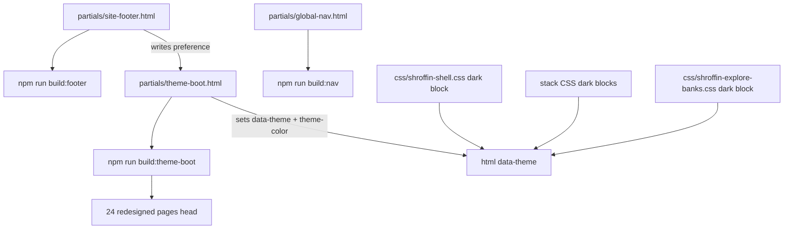

# Dark / Light / Default — Main build recipe

**Source:** Cursor plan `dark_theme_main_build_bfe2731e`
**Status:** CONFIRM BUILD — implement exactly


# Dark / Light / Default — Main build recipe (Plan mode)

### 0. Status

**SHIPPED** — Phase I implemented; lint:responsive green.

- Recipe docs written on CONFIRM BUILD.
- Originally required Agent to first write:
  - [`super-review-1/themes/_dark-mode-main-build-recipe.md`](super-review-1/themes/_dark-mode-main-build-recipe.md) (this full recipe)
  - [`super-review-1/themes/_dark-mode-main-build-recipe-ledger.json`](super-review-1/themes/_dark-mode-main-build-recipe-ledger.json)
  then implement exactly as below. **Do not implement until the human says `CONFIRM BUILD`.**

---

### 0.1 CTO fail-closed gates (validated — must obey)

Hostile review kept only **correct** criticisms. Invalid ones are listed so they are not “fixed” by accident.

| # | Severity | Valid criticism | Plan fix (locked) |
|---|---|---|---|
| 1 | BLOCKER | Guide wash classes were invented (`--tax` etc). Live classes are `--ink-*` / `--glow-*` only ([`css/shroffin-editorial.css`](css/shroffin-editorial.css) L1621–1669). | Override real **ink-*** washes → locked brand gradient; leave **glow-*** (already dark-friendly) as-is. |
| 2 | BLOCKER | “Rescan later” for Appendix C fails build-ready (~64 ink-alpha, ~16 blue-alpha, ~62 black-alpha excl device, white frost panels). | Phase 4 lists **file:line + recipe**; ship gate = zero unresolved paints. |
| 3 | BLOCKER | [`scripts/check-responsive-contracts.js`](scripts/check-responsive-contracts.js) L131–141 hard-requires `inert`; `lint:responsive` / `predeploy` will fail after live boot. | Same PR: require `live`; keep ban on **static** `<html data-theme`. |
| 4 | MAJOR | [`index.html`](index.html) is **built** from [`templates/layouts/home.html`](templates/layouts/home.html) (`data/content-pages.json`). Editing only index is overwritten; editing only layout leaves index stale. | Edit **layout only** → `npm run build:content -- --write`. Never hand-edit index alone. Golden compares `mainOnly` — layout CSS head changes do not require bless for body golden. |
| 5 | MAJOR | FOUC: boot sets `data-theme` before CSS, but home **inline** `<style>` still hardcodes light (`--gn-bg: #fcfcfd`, story `#1a1a1a`/`#0a0a0a`) until CSS twins exist. | Boot sets critical `html` background + `color-scheme`; home layout inline tokens twin under `html[data-theme]`. |
| 6 | MAJOR | First-visit Dark pressed with empty storage + OS listener while unset → fights product dark-first / never persists. | Unset: Dark pressed, **no write**. Any pill tap **always writes**. `matchMedia` listener **only** when preference === `system`. |
| 7 | MAJOR | Autofill `#fff` inset + `.site-footer { color: rgba(0,0,0,0.56) }` (shell L1547) — `color-scheme` alone does not fix. | Explicit dark remaps (Appendix C). |
| 8 | MAJOR | Wrong dock selector in draft. Real: `.hlc-apply-dock:not([hidden]) .hlc-btn-primary:disabled` (explore L6763). | Use exact selector; bg `rgba(10,132,255,0.40)`. |
| 9 | MAJOR | Footer pill placement without breaking copyright / official-links bands. | **No new wrapper region.** Insert `.site-footer-theme` as sibling of `.site-footer-copy` inside existing `.site-footer-bottom-row`; CSS grid on desktop only. |
| 10 | MAJOR | Home stage literals `#0a0a0a` in calm-phone L11 + level-field L12 must use `var(--home-device-stage)`; calm-phone `#000` screen L129/179 **exempt**. | Wire tokens; do not retint titanium/bezel/`#000` screens. |

**Dismissed (do not “fix”):**

- “Must kill the second `:root` `--shroffin-surface` color-mix line” — **false**. One `html[data-theme="dark"] { --shroffin-surface: #121212 }` wins both light declarations. Mix-bases still required for other `color-mix` consumers.
- CSP blocking footer inline script — **no site CSP**.
- Education pages getting footer pill — `build:footer` only walks 24 redesigned paths; education has no footer markers.
- `--mag-*` needing a separate dark block — they alias shell and inherit; only hardcoded editorial paints need Appendix C.
- Extracting footer JS to `js/` — optional hygiene, not required for v1 (matches chrome partial pattern).
- Adding `.site-footer-bottom-tools` wrapper — **rejected** (structural region change).

---

### 0.2 Architecture & structure freeze (binding)

**Theme work paints only.** It must not disturb layout geometry, page structure, or interaction regions.

#### Always

1. **Paint via tokens / `html[data-theme]` overrides** — same token names, second value set.
2. **Keep HTML regions identical** — same nav, main, footer bands, Apply/Explore/Guide DOM. Allowed HTML delta: (a) footer theme pill as **sibling** inside existing `.site-footer-bottom-row`; (b) theme-boot script body inside existing markers; (c) optional `<meta name="theme-color">` created by boot at runtime (not static in 24 heads).
3. **Keep CSS layout properties unchanged** — do not edit `display`/`grid`/`flex`/`position`/`width`/`padding`/`margin`/`gap` of existing layout owners except the **minimal** footer desktop grid that only places the new pill beside copyright (official links stay next band).
4. **Explore borders:** promote repeated ink-alpha borders to page tokens with **light-identical** values first, then twin under dark — one source of truth, no per-line layout churn.
5. **Home:** edit colors/vars inside existing `templates/layouts/home.html` `<style>` only; then `npm run build:content -- --write`. No section moves.
6. **Device props:** titanium/bezel/`#000` screens stay; only page/stage tokens follow theme.

#### Never

- New wrapper regions that regroup footer / hero / story / Explore chrome.
- Redesigning Apply/Explore/Guide structure “while theming.”
- Invert filters, parallel `--dark-*` names, second theme stylesheet.
- Changing light look (except Explore border literals → equivalent tokens with same computed light color).
- Touching education / `css/style.css` / `pages/_*.html`.
- Changing **any** existing customer-facing wording (see §0.2.1).

#### Completeness law

Every phase ships **full paste-ready code + exact commands + verify**. No “Agent fills in later,” no guessed selectors, no partial Appendix C.

---

### 0.2.1 Absolute copy freeze (binding — founder surety)

**Zero wording changes.** Theme work is **UI/UX paint + chrome only**. Every sentence, headline, button label, nav word, FAQ answer, disclaimer, guide paragraph, form label, and legal line that already exists on the site must stay **byte-identical**.

#### Always

1. Change **colors, surfaces, borders, shadows, logos swap, theme-color, footer theme icons** — not words.
2. Treat customer-facing strings as locked: pages, partials, content sources, home layout body HTML, Apply/Explore/Guide copy, footer copyright / disclaimers / official-link labels.
3. Footer theme control may add **only** the three new icon buttons (Default / Light / Dark) with `aria-label` / `visually-hidden` for those three preference names — **no** Appearance title, **no** helper sentence, **no** rewrite of existing footer sentences.
4. Ship gate: `mainOnly` / body text of the 24 redesigned pages must match pre-theme wording except the inserted `.site-footer-theme` block.

#### Never

- Rewrite, “improve,” shorten, expand, or rephrase any existing string “while theming.”
- Change nav labels, CTAs, guide titles, bank names, rank chip words, Apply step text, calculators labels, about/home marketing copy.
- Change `aria-label` / `title` / `alt` / `placeholder` on **existing** controls (theme pill is the only new control).
- Touch content markdown / JSON copy sources unless a build forces a chrome stitch — and even then, **do not edit prose**.
- “Fix typos” or brand-voice edits in this PR — out of scope; separate ask only.

#### Verify (mandatory)

```bash
cd "/home/yash/Projects Etc & aoo/aoo-static-gh"
# After build: confirm no prose drift (Agent must diff page text; only allowed HTML delta = footer theme pill + theme-boot script body).
# Fail the ship if any headline/CTA/body sentence changed.
```

---

### 0.3 Job-risk gate (final hostile pass — locked)

Any Agent that ships without these paste-ready fixes is treated as **build incomplete**:

| ID | Failure if missed | Locked fix location |
|---|---|---|
| JR-1 | Desktop Guide chapter strip stays white | §4.C mag-index ≥834 frost |
| JR-2 | Phone secondary CTA `::before` stays `#0066cc` | §4.A mobile media |
| JR-3 | Reduced-motion flip scrim stays light | §4.C prefers-reduced-motion |
| JR-4 | Product-demo home indicator vanishes on dark | §4.E `.spd-home-indicator` |
| JR-5 | Home feature body unreadable on Light; Phase 2/4 `--gn-bg` fight | Single home twin owner §4.F only |
| JR-6 | Apply resting field borders invisible | §4.B slate `rgba(15,23,42,0.08)` |
| JR-7 | Discipline rule still forbids live theme | §8 paste-ready rule text |
| JR-8 | Partial manifest / stale layout footers | Full `site.webmanifest` + sync order footer→layout-chrome |

**Golden:** style-only home layout changes → `npm run build:content -- --write` (no bless; `mainOnly` ignores `<style>`).

**CI:** update `check-responsive-contracts.js` inert→live in same PR as boot or `lint:responsive` / `predeploy` red.

---

### 1. Goal & non-goals

**Goal:** Ship Dark / Light / Default on the **24** paths in [`data/redesigned-pages.json`](data/redesigned-pages.json) with nearly zero runtime surprises — **paint/UI only**, layouts and structure frozen, **existing wording frozen** (§0.2.1).

**Non-goals:** Theme education / `css/style.css` / `pages/_*.html`; delete education; invert; invent hex outside palette lock + Appendix C; cool-blue canvas; pure `#000` page canvas; fixed-dark home islands; Appearance title/helper; change light `#0071e3`; **any layout/structural redesign**; new footer wrapper regions; **any change to existing wording/copy** (paint/UI only — §0.2.1).

**Dependencies:** none new.

---

### 2. Color law (binding)

Only [`_dark-mode-palette-lock.md`](super-review-1/themes/_dark-mode-palette-lock.md) §§2–4 + **Appendix C**. Compact box:

```
SURFACE: #121212 | #1E1E1E | #2C2C2C | #383838
INK: #F5F5F7 | soft #C7C7CC | muted #A1A1A6 | ghost #636366
LINK: #2997FF | active/visited alias same
BLUE_DARK: #0A84FF (accents) | filled CTAs #0071e3 / #0076df / #006edb flat
BLUE_LIGHT: #0071e3 EXACT
LINES: white-alpha 0.16/0.12/0.08; gn-border 0.10; veil rgba(0,0,0,0.45)
EXPLORE_ROW: selected #1A2F4A | hover #1A2330 | strong #2C2C2C
RANKS: helpful #8FDBA5/#A3E4B5 on #1B3D2F; costly #F2A4A0/#FFB4AB on #3D1F1F; grace #F5D78E on #3A2E14
PLATE: #FFFFFF pad 3px hair rgba(0,0,0,0.08)
HOME_DARK: story #121212 | ink #F5F5F7 | stage #1E1E1E
HOME_LIGHT: story #F5F5F7 | ink #1d1d1f | stage #E8E8ED
PWA: #121212; light meta #fcfcfd
HARDCODE: Appendix C only
EXEMPT: phone titanium/bezel greys; education/legacy
```

**PREP-15 attach in PR:** helpful ~7.3:1 / ~8.2:1; costly ~7.5:1 / ~8.8:1; grace ~9.5:1 (text-on-chip AA).

---

### 3. Architecture spine



| Owner | Path | Sync |
|---|---|---|
| Boot | [`partials/theme-boot.html`](partials/theme-boot.html) | `npm run build:theme-boot` + `npm run build:layout-chrome` |
| Footer pill | [`partials/site-footer.html`](partials/site-footer.html) | `npm run build:footer` |
| Nav logo (already hooked) | [`partials/global-nav.html`](partials/global-nav.html) | no markup change; `check:nav` |
| Shell tokens + chrome remaps + pill CSS | [`css/shroffin-shell.css`](css/shroffin-shell.css) | none |
| Explore | [`css/shroffin-explore-banks.css`](css/shroffin-explore-banks.css) | none |
| Apply / calc / editorial / APF / utility / about / home / product-demo | owning CSS + home layout | none |
| Contracts | [`scripts/check-responsive-contracts.js`](scripts/check-responsive-contracts.js) | must update inert→live |
| PWA | [`site.webmanifest`](site.webmanifest) | hand edit |
| Storage | `localStorage['shroffin-color-preference']` ∈ `{dark,light,system}` | — |
| Paint | `html[data-theme="dark"|"light"]` only | — |

**Placement law:** append `html[data-theme="dark"]` (and scoped page) blocks **in the same owning CSS file**. No `--dark-*` names. No new theme stylesheet.

---

### 4. Implementation phases

#### Phase 1 — Shell dark token overrides

**File:** [`css/shroffin-shell.css`](css/shroffin-shell.css)  
**Where:** After `:root` block (~L154), before other rules; keep existing logo swap L698–708.

**Paste-ready:**

```css
/* Phase I — shell dark twins (palette lock). Same names; light :root untouched. */
html[data-theme="dark"] {
  color-scheme: dark;
  --shroffin-ink: #F5F5F7;
  --shroffin-ink-soft: #C7C7CC;
  --shroffin-muted: #A1A1A6;
  --shroffin-ghost: #636366;
  --shroffin-blue: #0A84FF;
  --shroffin-btn-primary: #0071e3;
  --shroffin-btn-primary-hover: #0076df;
  --shroffin-btn-primary-active: #006edb;
  --shroffin-btn-primary-shadow: none;
  --shroffin-btn-primary-shadow-hover: none;
  --shroffin-btn-primary-shadow-active: none;
  --shroffin-link: #2997FF;
  --shroffin-link-active: var(--shroffin-link);
  --shroffin-link-visited: var(--shroffin-link);
  --shroffin-link-external: var(--shroffin-link);
  --shroffin-link-external-active: var(--shroffin-link);
  --shroffin-link-external-visited: var(--shroffin-link);
  --shroffin-canvas-mix-base: #121212;
  --shroffin-footer-mix-base: #1E1E1E;
  --shroffin-surface: #121212;
  --shroffin-footer: #1E1E1E;
  --shroffin-paper-note: #2C2C2C;
  --shroffin-hair: rgba(255, 255, 255, 0.12);
  --shroffin-hair-soft: rgba(255, 255, 255, 0.08);
  --shroffin-rule: rgba(255, 255, 255, 0.16);
  --shroffin-focus: #0A84FF;
  --shroffin-gn-frost: #1E1E1E;
  --shroffin-gn-bg: rgba(30, 30, 30, 0.80);
  --shroffin-gn-bg-fallback: rgba(30, 30, 30, 0.96);
  --shroffin-gn-bg-open: rgba(30, 30, 30, 0.92);
  --shroffin-gn-veil: rgba(0, 0, 0, 0.45);
  --shroffin-gn-border: rgba(255, 255, 255, 0.10);
  --shroffin-field-line: rgba(255, 255, 255, 0.16);
  --shroffin-field-line-focus: var(--shroffin-btn-primary);
  --shroffin-field-line-invalid: rgba(255, 105, 97, 0.70);
  --shroffin-field-line-valid: rgba(48, 209, 88, 0.50);
  --shroffin-field-placeholder: rgba(161, 161, 166, 0.55);
}

html[data-theme="light"] {
  color-scheme: light;
}
```

**Cascade law (CTO):** `html[data-theme="dark"]` beats `:root`. Setting `--shroffin-surface: #121212` once overrides **both** light lines (`#fcfcfd` and the `color-mix` line). Still **must** twin `--shroffin-canvas-mix-base` / `--shroffin-footer-mix-base` so remaining `color-mix(... mix-base)` consumers (editorial, Explore washes) do not mix toward white.

**Commands:** none (CSS only).  
**Verify:** DevTools `data-theme=dark` → surface `#121212`, mix-base `#121212`, ink `#F5F5F7`, blue `#0A84FF`; light `:root` unchanged when `data-theme=light` / attribute removed.

---

#### Phase 2 — Stack dark overrides

**Apply** — append to [`css/shroffin-apply.css`](css/shroffin-apply.css):

```css
html[data-theme="dark"] .hl-apply-page {
  --apply-ink-secondary: #C7C7CC;
  --apply-field-wash: #1E1E1E;
  --apply-field-wash-hover: #2C2C2C;
  --apply-verify-wash: #1A2F4A;
  --apply-verify-wash-active: #243A52;
  --apply-error-wash: #3D1F1F;
  --apply-status-ok: #30D158;
  --apply-status-ok-bright: #32D74B;
  --apply-status-bad: #FF6961;
  --apply-blue-press: var(--shroffin-btn-primary-hover);
}
```

**Calc** — append to [`css/shroffin-calculators.css`](css/shroffin-calculators.css):

```css
html[data-theme="dark"] .calc-page {
  --calc-line-soft: rgba(255, 255, 255, 0.06);
  --calc-hub-surface: #2C2C2C;
  --calc-hub-elev:
    0 3px 10px rgba(0, 0, 0, 0.35),
    0 10px 28px rgba(0, 0, 0, 0.40);
}
```

**Guide / editorial** — append to [`css/shroffin-editorial.css`](css/shroffin-editorial.css):

```css
html[data-theme="dark"] body.guide-reading {
  --guide-card-surface: #2C2C2C;
  --guide-card-elev:
    0 3px 10px rgba(0, 0, 0, 0.35),
    0 10px 28px rgba(0, 0, 0, 0.40);
}

/* Q18 — REAL classes only (editorial L1621–1641). Ink washes → locked brand gradient.
   Glow washes (L1649–1669) already dark-friendly — do NOT invent --tax/--docs names. */
html[data-theme="dark"] .guide-title-wash--ink-siri,
html[data-theme="dark"] .guide-title-wash--ink-sea,
html[data-theme="dark"] .guide-title-wash--ink-sky,
html[data-theme="dark"] .guide-title-wash--ink-dusk,
html[data-theme="dark"] .guide-title-wash--ink-ember,
html[data-theme="dark"] .guide-title-wash--ink-gold {
  --guide-title-g: linear-gradient(90deg, #5E5CE6 0%, #BF5AF2 42%, #147CE5 100%);
}
```

**APF** — append to [`css/project-approvals.css`](css/project-approvals.css):

```css
html[data-theme="dark"] {
  --apf-line-soft: rgba(255, 255, 255, 0.06);
}
```

**Utility** — append to [`css/shroffin-utility-pages.css`](css/shroffin-utility-pages.css):

```css
html[data-theme="dark"] .utility-page {
  --utility-sitemap-hover: var(--shroffin-link);
}
```

**About / mag aliases** — inherit shell via `--about-*` / `--mag-*` = `var(--shroffin-*)`. No separate mag dark block.

**Home stance** — append to [`css/shroffin-home.css`](css/shroffin-home.css):

```css
html[data-theme="dark"] .stance {
  --stance-line: rgba(255, 255, 255, 0.10);
}
```

**Home story / device / inline FOUC** — **single owner = §4.F only** (do not duplicate `--gn-bg` / story twins here — dual blocks cause FOUC fights).

Phase 2 only wires stage CSS (theme-follow; **not** exempt titanium):
   - [`css/shroffin-home-calm-phone.css`](css/shroffin-home-calm-phone.css) L11: `background: var(--home-device-stage);`
   - [`css/shroffin-home-level-field.css`](css/shroffin-home-level-field.css) L12: same
   - **Exempt:** calm-phone L129 / L179 `background: #000` (device screen) + bezel titanium gradients

**Product-demo band** — `html[data-theme="dark"] .spd-section--home { background: #1E1E1E; }` (or footer token). Device titanium greys **exempt**.

**Commands (mandatory after layout edit):**

```bash
cd "/home/yash/Projects Etc & aoo/aoo-static-gh"
npm run build:content -- --write
# Expect: index.html regenerated from templates/layouts/home.html
# Do NOT hand-edit index.html alone — next content write overwrites it.
# Golden compares mainOnly — layout <style> changes do not require bless.
```

**Verify:** Apply/Calc/Guide/APF/Utility/Home under `data-theme=dark` use locked stack hexes; under light unchanged; titanium/`#000` screens unchanged; `index.html` story tokens match layout.

---

#### Phase 3 — Explore dark + plate + ranks + border ladder (no layout change)

**File:** [`css/shroffin-explore-banks.css`](css/shroffin-explore-banks.css)

**3.A Light-identical token promotion (one source of truth — paint only)**

Add to `.explore-banks-page` (~after L94 plate tokens):

```css
  /* Ink-alpha border ladder — light-identical to prior literals; dark twins below. */
  --hlc-rule-06: rgba(29, 29, 31, 0.06);
  --hlc-rule-08: rgba(29, 29, 31, 0.08);
  --hlc-rule-10: rgba(29, 29, 31, 0.10);
  --hlc-rule-14: rgba(29, 29, 31, 0.14);
  --hlc-rule-18: rgba(29, 29, 31, 0.18);
  --hlc-rule-28: rgba(29, 29, 31, 0.28);
  --hlc-drawer-veil: rgba(29, 29, 31, 0.35);
```

**Retarget border/backdrop literals → tokens (value only; no layout props):**

| Lines | Token |
|---|---|
| 3638, 4294, 4412 | `var(--hlc-rule-18)` |
| 3956, 5664, 5668, 5761, 7253 | `var(--hlc-rule-10)` |
| 5673, 5686, 5895, 6443, 6469, 6495, 6568 | `var(--hlc-rule-08)` |
| 5840, 5886, 6304 | `var(--hlc-rule-14)` |
| 6159, 6237, 6381 | `var(--hlc-rule-06)` |
| 7108 | `var(--hlc-rule-28)` |
| 5379 drawer backdrop `background` | `var(--hlc-drawer-veil)` |

Light look unchanged.

**Freeze discipline:** Before shipping `--hlc-rule-*` / `--hlc-drawer-veil`, append them to Explore ownership in [`super-review-1/themes/_dark-mode-phase-f-explore-ownership.md`](super-review-1/themes/_dark-mode-phase-f-explore-ownership.md) (and Phase B freeze ledger stack_local list if the freeze tracks Explore roles). Same names, two value sets — not `--dark-hlc-*`.

**3.B Dark twins + chip/dock** — append:

```css
html[data-theme="dark"] .explore-banks-page {
  --hlc-wash: rgba(255, 255, 255, 0.08);
  --hlc-surface: rgba(255, 255, 255, 0.12);
  --hlc-surface-strong: #2C2C2C;
  --hlc-row-selected: #1A2F4A;
  --hlc-row-hover: #1A2330;
  --hlc-row-line: rgba(255, 255, 255, 0.06);
  --hlc-row-lift:
    0 1px 3px rgba(0, 0, 0, 0.28),
    0 4px 14px rgba(0, 0, 0, 0.22);
  --hlc-card-lift:
    0 8px 28px rgba(0, 0, 0, 0.28),
    0 24px 56px rgba(0, 0, 0, 0.20);
  --hlc-card-surface: #1E1E1E;
  --hlc-line: rgba(154, 163, 181, 0.32);
  --hlc-line-soft: rgba(154, 163, 181, 0.18);
  --hlc-line-faint: rgba(154, 163, 181, 0.10);
  --hlc-delta-wash: rgba(245, 215, 142, 0.22);
  --hlc-rank-helpful-ink: #8FDBA5;
  --hlc-rank-helpful-num: #A3E4B5;
  --hlc-rank-helpful-bg: #1B3D2F;
  --hlc-rank-costly-ink: #F2A4A0;
  --hlc-rank-costly-num: #FFB4AB;
  --hlc-rank-costly-bg: #3D1F1F;
  --hlc-rank-grace-ink: #F5D78E;
  --hlc-rank-grace-bg: #3A2E14;
  --hlc-field-label: #A1A1A6;
  --hlc-field-hint: #A1A1A6;
  --hlc-field-box-line: #484848;
  --hlc-input-field-line: #484848;
  --hlc-section-line: #383838;
  --hlc-section-line-strong: #636366;
  --hlc-seg-track: #1E1E1E;
  --hlc-drawer-strip: #2C2C2C;
  --hlc-drawer-rule: #383838;
  --hlc-intel-surface: #1E1E1E;
  --hlc-intel-line: rgba(255, 255, 255, 0.10);
  --hlc-meta-ink: #A1A1A6;
  --hlc-ink-soft: #C7C7CC;
  --hlc-text-tertiary: #8E8E93;
  --hlc-link-hover: var(--shroffin-link);
  --hlc-limit-house: #E0A070;
  --hlc-limit-income: #7EB6FF;
  --hlc-title-wash-from: #E8EAED;
  --hlc-title-wash-to: #A1A1A6;
  /* Same as light: no artificial plate; keep any white that is in the mark file. */
  --hlc-logo-plate: transparent;
  --hlc-logo-plate-pad: 0px;
  --hlc-logo-plate-radius: 0.2rem;
  --hlc-logo-plate-line: transparent;
  --hlc-rule-06: rgba(255, 255, 255, 0.06);
  --hlc-rule-08: rgba(255, 255, 255, 0.08);
  --hlc-rule-10: rgba(255, 255, 255, 0.10);
  --hlc-rule-14: rgba(255, 255, 255, 0.12);
  --hlc-rule-18: rgba(255, 255, 255, 0.14);
  --hlc-rule-28: rgba(255, 255, 255, 0.18);
  --hlc-drawer-veil: rgba(0, 0, 0, 0.45);
}

html[data-theme="dark"] .hlc-chip[aria-pressed="true"] {
  background: rgba(10, 132, 255, 0.14);
  border-color: rgba(10, 132, 255, 0.45);
  color: var(--shroffin-blue);
}

html[data-theme="dark"] .hlc-apply-dock:not([hidden]) .hlc-btn-primary:disabled {
  background: rgba(10, 132, 255, 0.40);
  box-shadow:
    0 8px 28px rgba(10, 132, 255, 0.16),
    0 2px 8px rgba(0, 0, 0, 0.28);
}

html[data-theme="dark"] .hlc-filters-scrim.is-open {
  background: rgba(0, 0, 0, 0.45);
}

html[data-theme="dark"] .hlc-toggle-chips .hlc-chip[aria-pressed="true"] {
  border-color: rgba(255, 255, 255, 0.18);
  background: rgba(255, 255, 255, 0.06);
}

html[data-theme="dark"] .hlc-toggle-chips .hlc-chip[aria-pressed="false"]:hover {
  background: rgba(255, 255, 255, 0.04);
}
```

**3.C Leftover Explore ink-alpha (complete paste-ready):**

```css
html[data-theme="dark"] .hlc-form-row-support {
  color: rgba(255, 255, 255, 0.45);
}
html[data-theme="dark"] .hlc-field-note {
  color: rgba(255, 255, 255, 0.45);
}
html[data-theme="dark"] .explore-banks-page .hlc-inputs-card .hlc-field-note.hlc-field-note--card-load {
  color: rgba(255, 255, 255, 0.55);
}
html[data-theme="dark"] .hlc-searching-dots span {
  background: rgba(255, 255, 255, 0.18);
}
html[data-theme="dark"] .hlc-filter-option:hover {
  background: rgba(255, 255, 255, 0.05);
}
html[data-theme="dark"] .hlc-drawer-scroll {
  scrollbar-color: rgba(255, 255, 255, 0.18) transparent;
}
html[data-theme="dark"] .hlc-drawer-scroll::-webkit-scrollbar-thumb {
  background: rgba(255, 255, 255, 0.16);
}
html[data-theme="dark"] .hlc-math-rule {
  background: rgba(255, 255, 255, 0.12);
}
html[data-theme="dark"] .hlc-story-track:not(.hlc-story-track--active) .hlc-math-num,
html[data-theme="dark"] .hlc-story-track:not(.hlc-story-track--active) .hlc-math-op {
  color: rgba(255, 255, 255, 0.55);
}
html[data-theme="dark"] .hlc-story-divider {
  background: rgba(255, 255, 255, 0.10);
}
```

L6771 / L7257–7258 elevation shadows: **keep black-alpha** (Q19).

Shell-aliased `--hlc-page-bg` / nav / icons inherit shell dark.

**Verify:** light borders identical; dark ladder works; plate `#FFFFFF`; PREP-15 ranks; **zero HTML/structure change**.

---

#### Phase 4 — Appendix C remaps (complete paste-ready — no placeholders)

**Law:** Dark-selector overrides (or light-identical token promotion). **No layout props.** Inventing hex outside palette lock + Appendix C **FAILS**.

**C.1 ink map** `rgba(29,29,31,α)` → white-α: `0.03→0.04`, `0.04→0.05`, `0.045→0.06`, `0.06→0.06`, `0.08→0.08`, `0.10→0.10`, `0.14→0.12`, `0.18→0.14`, `0.28→0.18`, `0.32→0.20`, `0.35→0.22`, `0.45→0.28`, `0.55→0.40`, `0.56→0.45`, `0.65→0.50`, `0.72→0.55`, `0.74→0.55`, `0.8→0.72`, `0.84→0.72`.

---

##### 4.A Shell chrome (append to `css/shroffin-shell.css`)

```css
html[data-theme="dark"] .hl-apply-field input:-webkit-autofill,
html[data-theme="dark"] .hl-apply-field input:-webkit-autofill:hover,
html[data-theme="dark"] .hl-apply-field input:-webkit-autofill:focus,
html[data-theme="dark"] .hl-apply-field input:-webkit-autofill:active,
html[data-theme="dark"] .guide-calc-input:-webkit-autofill,
html[data-theme="dark"] .guide-calc-input:-webkit-autofill:hover,
html[data-theme="dark"] .guide-calc-input:-webkit-autofill:focus,
html[data-theme="dark"] .guide-calc-input:-webkit-autofill:active,
html[data-theme="dark"] .hlc-field input:-webkit-autofill,
html[data-theme="dark"] .hlc-field input:-webkit-autofill:hover,
html[data-theme="dark"] .hlc-field input:-webkit-autofill:focus,
html[data-theme="dark"] .hlc-field input:-webkit-autofill:active,
html[data-theme="dark"] .calc-input:-webkit-autofill,
html[data-theme="dark"] .calc-input:-webkit-autofill:hover,
html[data-theme="dark"] .calc-input:-webkit-autofill:focus,
html[data-theme="dark"] .calc-input:-webkit-autofill:active,
html[data-theme="dark"] .apf-input:-webkit-autofill,
html[data-theme="dark"] .apf-input:-webkit-autofill:hover,
html[data-theme="dark"] .apf-input:-webkit-autofill:focus,
html[data-theme="dark"] .apf-input:-webkit-autofill:active {
  box-shadow: 0 0 0 1000px #1E1E1E inset;
  -webkit-text-fill-color: var(--shroffin-ink);
}

html[data-theme="dark"] .globalnav-link,
html[data-theme="dark"] .globalnav-flyout-trigger,
html[data-theme="dark"] .globalnav-compact-toggle {
  color: rgba(245, 245, 247, 0.72);
}

html[data-theme="dark"] .globalnav-submenu-link:hover,
html[data-theme="dark"] .globalnav-submenu-link:hover :where(.globalnav-submenu-label, .globalnav-submenu-value) {
  color: var(--shroffin-link);
}

html[data-theme="dark"] #nav-support-flyout .globalnav-whatsapp-icon,
html[data-theme="dark"] #nav-support-flyout .globalnav-submenu-link:hover .globalnav-whatsapp-icon {
  color: #F5F5F7;
}

html[data-theme="dark"] .home-hero-cta-secondary,
html[data-theme="dark"] .about-cta-secondary,
html[data-theme="dark"] .home-hero-cta-secondary:link,
html[data-theme="dark"] .home-hero-cta-secondary:visited,
html[data-theme="dark"] .about-cta-secondary:link,
html[data-theme="dark"] .about-cta-secondary:visited {
  color: #0A84FF;
  border-color: #0A84FF;
}

@media (max-width: 833px) {
  html[data-theme="dark"] .home-hero-cta-secondary::before,
  html[data-theme="dark"] .about-cta-secondary::before {
    border-color: #0A84FF;
  }
}

html[data-theme="dark"] .shroffin-sel-thumb--pill {
  background: #2C2C2C;
  box-shadow: 0 1px 2px rgba(0, 0, 0, 0.35);
}

html[data-theme="dark"] .site-footer {
  color: rgba(255, 255, 255, 0.45);
}
```

---

##### 4.B Apply (`css/shroffin-apply.css`)

```css
html[data-theme="dark"] .hl-apply-disclose:hover,
html[data-theme="dark"] .hl-apply-disclose:focus-visible {
  text-decoration-color: rgba(255, 255, 255, 0.28);
}
html[data-theme="dark"] .hl-apply-disclose:active {
  text-decoration-color: rgba(255, 255, 255, 0.45);
}
html[data-theme="dark"] .hl-apply-bank-remove:hover,
html[data-theme="dark"] .hl-apply-bank-remove:focus-visible {
  text-decoration-color: rgba(255, 255, 255, 0.28);
}
html[data-theme="dark"] .hl-apply-bank-remove:active {
  text-decoration-color: rgba(255, 255, 255, 0.45);
}
html[data-theme="dark"] .hl-apply-field label {
  color: rgba(255, 255, 255, 0.72);
}
html[data-theme="dark"] .hl-apply-phone-prefix {
  color: rgba(255, 255, 255, 0.45);
}
html[data-theme="dark"] .hl-apply-verify {
  color: rgba(255, 255, 255, 0.55);
}
html[data-theme="dark"] .hl-apply-consent a:hover,
html[data-theme="dark"] .hl-apply-consent a:focus-visible,
html[data-theme="dark"] .hl-apply-consent a:visited:hover,
html[data-theme="dark"] .hl-apply-consent a:visited:focus-visible {
  text-decoration-color: rgba(255, 255, 255, 0.45);
}
html[data-theme="dark"] .hl-apply-consent a:active {
  text-decoration-color: rgba(255, 255, 255, 0.50);
}
html[data-theme="dark"] .hl-apply-success {
  background: rgba(0, 0, 0, 0.45);
}

html[data-theme="dark"] .hl-apply--contact .hl-apply-phone-row,
html[data-theme="dark"] .hl-apply--contact .hl-apply-email-row {
  box-shadow: inset 0 1px 0 rgba(255, 255, 255, 0.06);
}
html[data-theme="dark"] .hl-apply--contact .hl-apply-phone-row:hover,
html[data-theme="dark"] .hl-apply--contact .hl-apply-email-row:hover {
  border-color: rgba(10, 132, 255, 0.18);
}
html[data-theme="dark"] .hl-apply--contact .hl-apply-field--phone:focus-within .hl-apply-phone-row,
html[data-theme="dark"] .hl-apply--contact .hl-apply-field--email:focus-within .hl-apply-email-row {
  border-color: rgba(10, 132, 255, 0.34);
  box-shadow: 0 0 0 4px rgba(10, 132, 255, 0.12);
}
html[data-theme="dark"] .hl-apply-verify:hover:not(:disabled):not(.is-verified),
html[data-theme="dark"] .hl-apply-verify:focus-visible:not(:disabled):not(.is-verified) {
  border-color: rgba(10, 132, 255, 0.18);
}
html[data-theme="dark"] .hl-apply-verify:active:not(:disabled):not(.is-verified) {
  border-color: rgba(10, 132, 255, 0.24);
}

html[data-theme="dark"] .hl-apply--review .hl-apply-context,
html[data-theme="dark"] .hl-apply-context {
  border-bottom-color: rgba(255, 255, 255, 0.08);
}
html[data-theme="dark"] .hl-apply-facts--primary > .hl-apply-fact {
  border-bottom-color: rgba(255, 255, 255, 0.06);
}
html[data-theme="dark"] .hl-apply--review .hl-apply-bank,
html[data-theme="dark"] .hl-apply-bank {
  border-bottom-color: rgba(255, 255, 255, 0.08);
}
html[data-theme="dark"] .hl-apply-commit,
html[data-theme="dark"] .hl-apply-submit-notice {
  border-top-color: rgba(255, 255, 255, 0.08);
}
html[data-theme="dark"] .hl-apply-phone-flag {
  box-shadow: inset 0 0 0 1px rgba(255, 255, 255, 0.12);
}
/* Resting slate borders rgba(15,23,42,0.08) at apply L1416/1579 */
html[data-theme="dark"] .hl-apply--contact .hl-apply-field > input,
html[data-theme="dark"] .hl-apply--contact .hl-apply-phone-row,
html[data-theme="dark"] .hl-apply--contact .hl-apply-email-row,
html[data-theme="dark"] .hl-apply-verify {
  border-color: rgba(255, 255, 255, 0.12);
}
html[data-theme="dark"] .hl-apply-toast {
  border-color: rgba(255, 255, 255, 0.08);
}
html[data-theme="dark"] .hl-apply-success-panel .hl-apply-success-ref {
  background: rgba(255, 255, 255, 0.04);
}
html[data-theme="dark"] .hl-apply-success-panel .hl-apply-success-help {
  border-top-color: rgba(255, 255, 255, 0.08);
}

@media (max-width: 833px) {
  html[data-theme="dark"] .hl-apply--review .hl-apply-review-actions {
    background: linear-gradient(to top, var(--shroffin-surface) 78%, rgba(18, 18, 18, 0));
  }
  html[data-theme="dark"] .hl-apply--contact .hl-apply-actions {
    background: linear-gradient(to top, var(--shroffin-surface) 85%, rgba(18, 18, 18, 0));
  }
}
```

Apply elevation shadows at L1823 / L1859: **keep black-alpha** (Q19). No layout changes.

---

##### 4.C Editorial (`css/shroffin-editorial.css`) — full blocks

```css
html[data-theme="dark"] .mag-toc-compact {
  background: rgba(30, 30, 30, 0.92);
}

html[data-theme="dark"] .guide-flip-focus-scrim {
  background: rgba(18, 18, 18, 0.42);
}
@supports not ((-webkit-backdrop-filter: blur(1px)) or (backdrop-filter: blur(1px))) {
  html[data-theme="dark"] .guide-flip-focus-scrim {
    background: rgba(18, 18, 18, 0.72);
  }
}

@media (max-width: 1199px) {
  html[data-theme="dark"] body.guide-reading .mag-index {
    background: rgba(30, 30, 30, 0.92);
  }
  html[data-theme="dark"] body.guide-reading .mag-index.has-more-left::before {
    background: linear-gradient(to left, rgba(18, 18, 18, 0), rgba(18, 18, 18, 0.88) 55%, rgba(18, 18, 18, 0.96));
  }
  html[data-theme="dark"] body.guide-reading .mag-index.has-more-right::after {
    background: linear-gradient(to right, rgba(18, 18, 18, 0), rgba(18, 18, 18, 0.88) 55%, rgba(18, 18, 18, 0.96));
  }
}

@media (min-width: 834px) {
  html[data-theme="dark"] body.guide-reading .mag-index.has-more-left::before {
    background: linear-gradient(to left, rgba(18, 18, 18, 0), rgba(18, 18, 18, 0.88) 55%, rgba(18, 18, 18, 0.96));
  }
  html[data-theme="dark"] body.guide-reading .mag-index.has-more-right::after {
    background: linear-gradient(to right, rgba(18, 18, 18, 0), rgba(18, 18, 18, 0.88) 55%, rgba(18, 18, 18, 0.96));
  }

  html[data-theme="dark"] body.guide-reading .mag-index-link.is-active,
  html[data-theme="dark"] body.guide-reading .mag-index-link[aria-current="true"],
  html[data-theme="dark"] body.guide-reading .mag-toc-shell .mag-index-link.is-active,
  html[data-theme="dark"] body.guide-reading .mag-toc-shell .mag-index-link[aria-current="true"] {
    background: rgba(255, 255, 255, 0.10);
  }
  html[data-theme="dark"] body.guide-reading .mag-index-link:hover,
  html[data-theme="dark"] body.guide-reading .mag-index-link:focus-visible {
    background: rgba(255, 255, 255, 0.06);
  }
  html[data-theme="dark"] body.guide-reading .mag-index-link.is-active:hover,
  html[data-theme="dark"] body.guide-reading .mag-index-link.is-active:focus-visible,
  html[data-theme="dark"] body.guide-reading .mag-index-link[aria-current="true"]:hover,
  html[data-theme="dark"] body.guide-reading .mag-index-link[aria-current="true"]:focus-visible {
    background: rgba(255, 255, 255, 0.14);
  }
}

@media (max-width: 833px) {
  html[data-theme="dark"] body.guide-reading .mag-index-link.is-active,
  html[data-theme="dark"] body.guide-reading .mag-index-link[aria-current="true"],
  html[data-theme="dark"] body.guide-reading .mag-index-link.is-active:link,
  html[data-theme="dark"] body.guide-reading .mag-index-link[aria-current="true"]:link,
  html[data-theme="dark"] body.guide-reading .mag-index-link.is-active:visited,
  html[data-theme="dark"] body.guide-reading .mag-index-link[aria-current="true"]:visited {
    background: rgba(255, 255, 255, 0.10);
  }
  html[data-theme="dark"] body.guide-reading .mag-index-link:hover,
  html[data-theme="dark"] body.guide-reading .mag-index-link:focus-visible {
    background: rgba(255, 255, 255, 0.06);
  }
  html[data-theme="dark"] body.guide-reading .mag-index-link.is-active:hover,
  html[data-theme="dark"] body.guide-reading .mag-index-link.is-active:focus-visible,
  html[data-theme="dark"] body.guide-reading .mag-index-link[aria-current="true"]:hover,
  html[data-theme="dark"] body.guide-reading .mag-index-link[aria-current="true"]:focus-visible,
  html[data-theme="dark"] body.guide-reading .mag-index-link.is-active:hover:link,
  html[data-theme="dark"] body.guide-reading .mag-index-link[aria-current="true"]:hover:link,
  html[data-theme="dark"] body.guide-reading .mag-index-link.is-active:focus-visible:link,
  html[data-theme="dark"] body.guide-reading .mag-index-link[aria-current="true"]:focus-visible:link {
    background: rgba(255, 255, 255, 0.14);
  }
}

/* Live guides use bare .mag-index (no mag-toc-shell on pages). Cover ≥834 frost L4760/5045. */
html[data-theme="dark"] body.guide-reading .mag-index,
html[data-theme="dark"] body.guide-reading .guide-hero + .mag-index,
html[data-theme="dark"] body.guide-reading .mag-toc-shell .mag-index {
  background: rgba(30, 30, 30, 0.82);
  border-block-end-color: rgba(255, 255, 255, 0.08);
}

@media (prefers-reduced-motion: reduce) {
  html[data-theme="dark"] .guide-flip-focus-scrim {
    background: rgba(18, 18, 18, 0.88);
  }
}
```

Thumb shadows L3240/3258: under dark keep black-alpha Q19 (already handled if sel-thumb pill twins).

---

##### 4.D Utility (`css/shroffin-utility-pages.css`)

```css
html[data-theme="dark"] .utility-page .legal-meta,
html[data-theme="dark"] .utility-page .notice,
html[data-theme="dark"] .utility-page .toc h2 {
  color: rgba(255, 255, 255, 0.45);
}
html[data-theme="dark"] .utility-page .sitemap-intro {
  color: rgba(255, 255, 255, 0.50);
}
html[data-theme="dark"] .utility-page .sitemap-group a {
  color: rgba(255, 255, 255, 0.50);
}
/* hover already uses var(--utility-sitemap-hover) → --shroffin-link */
html[data-theme="dark"] .utility-page main th {
  background: rgba(255, 255, 255, 0.04);
}
```


---

##### 4.E Calc / APF / Home stance / Product-demo

```css
/* calc — live dock frost (inside existing max-width 833 dock styles) */
html[data-theme="dark"] .calc-live-dock-inner {
  background:
    linear-gradient(180deg, rgba(30, 30, 30, 0.92), rgba(30, 30, 30, 0.82)),
    var(--calc-wash);
  box-shadow:
    0 10px 28px rgba(0, 0, 0, 0.35),
    0 1px 0 rgba(255, 255, 255, 0.08) inset;
}

html[data-theme="dark"] .calc-choice-option:hover .calc-choice-face {
  border-color: rgba(10, 132, 255, 0.35);
}
html[data-theme="dark"] .calc-choice-option input:checked + .calc-choice-face {
  background: rgba(10, 132, 255, 0.06);
}

html[data-theme="dark"] .apf-options {
  background: rgba(30, 30, 30, 0.96);
  box-shadow: 0 12px 32px rgba(0, 0, 0, 0.35);
}
html[data-theme="dark"] .apf-activity-ring {
  border-color: rgba(10, 132, 255, 0.2);
}

@media (hover: hover) and (pointer: fine) {
  html[data-theme="dark"] .stance-item:hover {
    background-color: rgba(30, 30, 30, 0.92);
    box-shadow: inset 0 0 0 1px rgba(255, 255, 255, 0.08);
  }
  html[data-theme="dark"] .stance-item:focus-visible {
    background-color: rgba(30, 30, 30, 0.92);
  }
}

html[data-theme="dark"] .spd-stage--phone .spd-ios-top {
  background: linear-gradient(
    180deg,
    rgba(18, 18, 18, 0.98) 0%,
    rgba(18, 18, 18, 0.92) 70%,
    rgba(18, 18, 18, 0) 100%
  );
}
html[data-theme="dark"] .spd-stage--phone .spd-home-indicator {
  background: rgba(255, 255, 255, 0.72);
}
html[data-theme="dark"] .spd-section--home {
  background: #1E1E1E;
}
```

---


##### 4.F Home layout inline (`templates/layouts/home.html` `<style>` only — then rebuild)

**Single owner for all home inline theme twins.** Do not change HTML structure. Inside existing `<style>`:

1. Replace `:root` gn hardcodes so they follow shell when available:

```css
:root {
  --gn-height: 48px;
  --gn-bg: var(--shroffin-surface, #fcfcfd);
  --gn-text: var(--shroffin-ink-soft, #3a3a3d);
  --gn-text-hover: var(--shroffin-ink, #1d1d1f);
  --gn-ink: var(--shroffin-ink, #1d1d1f);
  --gn-max: 1068px;
  --font-brand: 'Google Sans Flex', sans-serif;
}
```

2. Replace `.home-story-dark` defaults (today `#1a1a1a` / `#0a0a0a`) with light theme-follow + dark twin:

```css
.home-story-dark {
  --home-story-bg: #F5F5F7;
  --home-story-ink: #1d1d1f;
  --home-device-stage: #E8E8ED;
}
html[data-theme="dark"] .home-story-dark {
  --home-story-bg: #121212;
  --home-story-ink: #F5F5F7;
  --home-device-stage: #1E1E1E;
}
/* Feature body: today white-alpha on dark island — must twin for Light */
html[data-theme="light"] .home-feature-body,
.home-story-dark .home-feature-body {
  color: rgba(29, 29, 31, 0.55);
}
html[data-theme="dark"] .home-feature-body {
  color: rgba(255, 255, 255, 0.55);
}
```

3. Dark chrome twins (one `--gn-bg` winning declaration only):

```css
html[data-theme="dark"] {
  --gn-bg: color-mix(in srgb, #0A84FF 0.75%, #121212);
  --gn-text: rgba(245, 245, 247, 0.72);
  --gn-text-hover: #F5F5F7;
  --gn-ink: #F5F5F7;
}
html[data-theme="dark"] body { color: #F5F5F7; }
html[data-theme="dark"] .home-hero { background: #1E1E1E; }
html[data-theme="dark"] .home-hero-title { color: #F5F5F7; }
html[data-theme="dark"] .home-hero-cta-secondary {
  color: #0A84FF;
  border-color: #0A84FF;
}
html[data-theme="dark"] .site-footer {
  background: #1E1E1E;
  color: rgba(255, 255, 255, 0.45);
}
html[data-theme="dark"] .site-footer-disclaimer-title,
html[data-theme="dark"] .site-footer-disclaimer,
html[data-theme="dark"] .site-footer-copy a:hover {
  color: #F5F5F7;
}
```

Calm-phone L11 + level-field L12: `background: var(--home-device-stage);` only. **Exempt** `#000` screens L129/179 + titanium bezel.

```bash
cd "/home/yash/Projects Etc & aoo/aoo-static-gh"
npm run build:content -- --write
# No bless — golden compares mainOnly; <style> head changes do not fail golden.
```

---

##### 4.G Ship gate

```bash
cd "/home/yash/Projects Etc & aoo/aoo-static-gh"
rg -n 'rgba\(29,\s*29,\s*31' css/shroffin-*.css css/project-approvals.css
rg -n 'rgba\(0,\s*113,\s*227' css/shroffin-*.css css/project-approvals.css
rg -n '#06c\b|#0066cc|1000px #fff' css/shroffin-*.css css/project-approvals.css
rg -n 'rgba\(252,\s*252,\s*253|#fcfcfd' css/shroffin-*.css css/project-approvals.css templates/layouts/home.html
```

Classify every remaining hit: `overridden` | `tokenized` | `shadow-keep` | `exempt-device`. Unmarked = incomplete.

**Also verify layout freeze:** no unintended `display`/`grid`/`position` changes outside footer pill desktop grid (Phase 6).

---

#### Phase 5 — Activate boot + sync + contracts

**Replace** [`partials/theme-boot.html`](partials/theme-boot.html) entire body:

```html
<!-- SHROFFIN_THEME_BOOT_START -->
<!--
  Phase I live theme boot. Spec: _dark-mode-phase-c-boot-injection.md §5
  Preference: localStorage['shroffin-color-preference'] ∈ {dark, light, system}
  Resolved: html[data-theme="dark"|"light"]; first visit unset → dark (do NOT write until user taps).
  Default (system) ≠ first visit. OS listener only when preference === system.
  theme-color: dark #121212 / light #fcfcfd
  FOUC: set data-theme + color-scheme + canvas background before stylesheets.
-->
<script data-shroffin-theme-boot="live">
(function () {
  var KEY = 'shroffin-color-preference';
  var root = document.documentElement;
  function resolve(pref) {
    if (pref === 'light') return 'light';
    if (pref === 'dark') return 'dark';
    if (pref === 'system') {
      return window.matchMedia('(prefers-color-scheme: dark)').matches ? 'dark' : 'light';
    }
    return 'dark';
  }
  function applyThemeColor(resolved) {
    var meta = document.querySelector('meta[name="theme-color"]');
    if (!meta) {
      meta = document.createElement('meta');
      meta.setAttribute('name', 'theme-color');
      if (document.head.firstChild) document.head.insertBefore(meta, document.head.firstChild);
      else document.head.appendChild(meta);
    }
    meta.setAttribute('content', resolved === 'dark' ? '#121212' : '#fcfcfd');
  }
  function apply(resolved) {
    root.setAttribute('data-theme', resolved);
    root.style.colorScheme = resolved;
    /* Critical canvas before CSS / home inline light hardcodes */
    root.style.backgroundColor = resolved === 'dark' ? '#121212' : '#fcfcfd';
    applyThemeColor(resolved);
  }
  var pref = null;
  try { pref = localStorage.getItem(KEY); } catch (e) {}
  if (pref !== 'dark' && pref !== 'light' && pref !== 'system') pref = null;
  apply(resolve(pref));
  window.__shroffinApplyColorPreference = function (next) {
    if (next !== 'dark' && next !== 'light' && next !== 'system') return;
    try { localStorage.setItem(KEY, next); } catch (e) {}
    apply(resolve(next));
    document.dispatchEvent(new CustomEvent('shroffin-theme-change', {
      detail: { preference: next, theme: resolve(next) }
    }));
  };
  try {
    window.matchMedia('(prefers-color-scheme: dark)').addEventListener('change', function () {
      var p = null;
      try { p = localStorage.getItem(KEY); } catch (e) {}
      if (p === 'system') {
        apply(resolve('system'));
        document.dispatchEvent(new CustomEvent('shroffin-theme-change', {
          detail: { preference: 'system', theme: resolve('system') }
        }));
      }
      /* If pref unset or dark/light: ignore OS changes */
    });
  } catch (e) {}
})();
</script>
<!-- SHROFFIN_THEME_BOOT_END -->
```

**Update** [`scripts/check-responsive-contracts.js`](scripts/check-responsive-contracts.js) L131–148 **in the same PR**:

```js
  if (!/data-shroffin-theme-boot="live"/.test(source)) {
    fail(file, 'theme-boot markers must contain the shared live partial');
  }
  if (
    !/SHROFFIN_THEME_BOOT_START[\s\S]*?data-shroffin-theme-boot="live"[\s\S]*?SHROFFIN_THEME_BOOT_END[\s\S]*?document\.documentElement\.classList\.add\(['"]js['"]/.test(
      source
    )
  ) {
    fail(
      file,
      'theme-boot must sit in <head> before the early js class script (and before CSS)'
    );
  }
  if (/<html\b[^>]*\bdata-theme=/.test(source)) {
    fail(
      file,
      'customer pages must not ship static data-theme on <html> (boot sets it at runtime)'
    );
  }
```

Update any other `inert` string mentions in that file’s messages. `lint:responsive` / `predeploy` must pass after this.

**Commands:**

```bash
cd "/home/yash/Projects Etc & aoo/aoo-static-gh"
npm run build:theme-boot
npm run build:layout-chrome
npm run check:theme-boot
# Expect: Canonical theme-boot is synchronized across 24 pages.
node scripts/check-responsive-contracts.js
# Expect: exit 0 (live fingerprint)
```

**Verify:** hard-refresh with cleared storage → `data-theme=dark`, storage still empty, canvas `#121212` before CSS, meta `#121212`, dark logo visible; `light` pref → light + meta `#fcfcfd`; OS flip ignored when unset/dark/light; OS flip applies only when `system`.

---

#### Phase 6 — Footer icon pill + sync (**no structural wrapper**)

**Structure freeze:** Do **not** add `.site-footer-bottom-tools`. Insert the pill as a **sibling** of `.site-footer-copy` inside the existing `.site-footer-bottom-row`. Official links nav stays the next sibling — same regions as today.

**Markup** in [`partials/site-footer.html`](partials/site-footer.html) — only change inside `.site-footer-bottom-row`:

```html
          <div class="site-footer-bottom-row">
            <p class="site-footer-copy">Copyright © 2026 Shroffin. All rights reserved.</p>
            <div class="site-footer-theme" role="group" aria-label="Color theme">
              <button type="button" class="site-footer-theme-btn" data-theme-pref="system" aria-label="Default" aria-pressed="false">
                <svg class="site-footer-theme-icon" viewBox="0 0 24 24" aria-hidden="true" focusable="false"><path fill="currentColor" d="M4 5h16a1 1 0 0 1 1 1v10a1 1 0 0 1-1 1h-6v2h2v1H8v-1h2v-2H4a1 1 0 0 1-1-1V6a1 1 0 0 1 1-1zm1 2v8h14V7H5z"/></svg>
              </button>
              <button type="button" class="site-footer-theme-btn" data-theme-pref="light" aria-label="Light" aria-pressed="false">
                <svg class="site-footer-theme-icon" viewBox="0 0 24 24" aria-hidden="true" focusable="false"><path fill="currentColor" d="M12 7a5 5 0 1 1 0 10 5 5 0 0 1 0-10zm0-5h1v3h-1V2zm0 17h1v3h-1v-3zM2 11h3v1H2v-1zm17 0h3v1h-3v-1zM4.2 4.2l2.1 2.1-.7.7-2.1-2.1.7-.7zm14.1 14.1 2.1 2.1-.7.7-2.1-2.1.7-.7zM4.2 19.8l.7.7-2.1 2.1-.7-.7 2.1-2.1zm14.1-14.1.7.7-2.1 2.1-.7-.7 2.1-2.1z"/></svg>
              </button>
              <button type="button" class="site-footer-theme-btn" data-theme-pref="dark" aria-label="Dark" aria-pressed="false">
                <svg class="site-footer-theme-icon" viewBox="0 0 24 24" aria-hidden="true" focusable="false"><path fill="currentColor" d="M12.1 2a9.9 9.9 0 0 0 0 19.8A10 10 0 0 1 12.1 2z"/></svg>
              </button>
            </div>
            <nav class="site-footer-legal-nav" aria-label="Official resources">
              <!-- existing official links list unchanged -->
```

Keep the existing `<ul class="site-footer-official-links">…</ul>` and closing tags exactly as today. Append script **once** before `<!-- SHROFFIN_FOOTER_END -->`:

```html
<script>
(function () {
  var KEY = 'shroffin-color-preference';
  var root = document.querySelector('.site-footer-theme');
  if (!root) return;
  var buttons = root.querySelectorAll('[data-theme-pref]');
  function currentPref() {
    var p = null;
    try { p = localStorage.getItem(KEY); } catch (e) {}
    if (p === 'dark' || p === 'light' || p === 'system') return p;
    return 'dark';
  }
  function syncPressed() {
    var pref = currentPref();
    buttons.forEach(function (btn) {
      var on = btn.getAttribute('data-theme-pref') === pref;
      btn.setAttribute('aria-pressed', on ? 'true' : 'false');
      btn.classList.toggle('is-active', on);
    });
  }
  buttons.forEach(function (btn) {
    btn.addEventListener('click', function () {
      var next = btn.getAttribute('data-theme-pref');
      if (typeof window.__shroffinApplyColorPreference === 'function') {
        window.__shroffinApplyColorPreference(next);
      } else {
        try { localStorage.setItem(KEY, next); } catch (e) {}
        location.reload();
      }
      syncPressed();
    });
  });
  syncPressed();
  document.addEventListener('shroffin-theme-change', syncPressed);
})();
</script>
```

**No** Appearance title. **No** helper text. Order: Default · Light · Dark.

**Preference UX:** unset → Dark pressed, storage empty; any tap **writes** via boot helper; OS listener only when `system`.

**CSS** in [`css/shroffin-shell.css`](css/shroffin-shell.css) — pill chrome + **minimal** desktop placement (does not regroup official links into a new region):

```css
.site-footer-theme {
  display: inline-flex;
  flex: 0 0 auto;
  align-items: center;
  gap: 0;
  padding: 2px;
  border: 1px solid var(--shroffin-hair);
  border-radius: 980px;
  background: var(--shroffin-paper-note);
}
.site-footer-theme-btn {
  display: inline-flex;
  align-items: center;
  justify-content: center;
  min-width: 44px;
  min-height: 44px;
  margin: 0;
  padding: 0;
  border: 0;
  border-radius: 980px;
  background: transparent;
  color: var(--shroffin-muted);
  cursor: pointer;
  transition: color var(--shroffin-micro-duration) var(--shroffin-color-ease),
    background-color var(--shroffin-micro-duration) var(--shroffin-color-ease);
}
.site-footer-theme-btn.is-active,
.site-footer-theme-btn[aria-pressed="true"] {
  color: var(--shroffin-ink);
  background: var(--shroffin-surface);
  box-shadow: 0 1px 2px rgba(0, 0, 0, 0.12);
}
html[data-theme="dark"] .site-footer-theme-btn.is-active,
html[data-theme="dark"] .site-footer-theme-btn[aria-pressed="true"] {
  background: #2C2C2C;
  box-shadow: 0 1px 2px rgba(0, 0, 0, 0.35);
}
.site-footer-theme-icon {
  width: 18px;
  height: 18px;
  display: block;
}

/* Phone: stack copy → pill → legal (existing column row) */
.site-footer-bottom-row {
  display: flex;
  flex-direction: column;
  align-items: flex-start;
  gap: 0.75rem;
  inline-size: 100%;
}

/* Desktop: copyright | pill on first band; legal still next band */
@media (min-width: 834px) {
  .site-footer-bottom-row {
    display: grid;
    grid-template-columns: minmax(0, 1fr) auto;
    grid-template-areas:
      "copy theme"
      "legal legal";
    column-gap: 1rem;
    row-gap: 0.55rem;
    align-items: center;
  }
  .site-footer-copy { grid-area: copy; }
  .site-footer-theme { grid-area: theme; justify-self: end; }
  .site-footer-legal-nav { grid-area: legal; }
}
```

**Commands:**

```bash
cd "/home/yash/Projects Etc & aoo/aoo-static-gh"
npm run build:footer
npm run check:footer
```

**Verify:** 375 / 834 / 1280 — copyright, pill, official links regions intact; 44×44 targets; education not synced; preference rules above.

---

#### Phase 7 — PWA + theme-color

**Replace entire** [`site.webmanifest`](site.webmanifest) with:

```json
{
  "name": "Shroffin",
  "short_name": "Shroffin",
  "icons": [
    { "src": "favicon.ico", "sizes": "48x48", "type": "image/x-icon" },
    { "src": "images/logos/android-chrome-192.png", "sizes": "192x192", "type": "image/png" },
    { "src": "images/logos/android-chrome-512.png", "sizes": "512x512", "type": "image/png" }
  ],
  "theme_color": "#121212",
  "background_color": "#121212",
  "display": "browser"
}
```

Meta `theme-color` set at runtime by boot (Phase 5): dark `#121212` / light `#fcfcfd`. Favicons unchanged (Phase G).

**Verify:** manifest both colors `#121212`; resolved dark meta `#121212`; light `#fcfcfd`.

---

#### Phase 8 — Full verify matrix

```bash
cd "/home/yash/Projects Etc & aoo/aoo-static-gh"
npm run build:theme-boot && npm run build:footer && npm run build:nav && npm run build:layout-chrome
npm run check:theme-boot
npm run check:footer
npm run check:nav
npm run check:theme-js-injectors
npm run lint:responsive
# optional: npm run build:site && npm test
```

Manual: FOUC dark-first; all 24 pages; Explore ranks + plate; logos light/dark; no invert; education present + hidden from primary nav; no `data-theme-island="fixed-dark"`; titanium exempt; **JR-1…JR-8 checklist green**.

**Discipline rule — paste-ready** edits to [`.cursor/rules/shroffin-theme-token-discipline.mdc`](.cursor/rules/shroffin-theme-token-discipline.mdc):

1. Opening status →:

```markdown
Light chrome ownership remains frozen in `super-review-1/themes/_dark-mode-phase-b-shell-freeze.md`.
Dark / Light / Default **shipped** (Phase I): paint via `html[data-theme]` + same token names; do not invent parallel `--dark-*` or a second theme sheet.
```

2. Always item 6 (boot) →:

```markdown
6. **Theme-boot** (Phase I live): edit only `partials/theme-boot.html`; propagate with `npm run build:theme-boot` (+ `build:layout-chrome` / content stitch). Fingerprint must be `data-shroffin-theme-boot="live"`. Do not add one-off head theme scripts outside markers.
```

3. **Forbidden:** remove the bullet that bans shipping dark palette / footer pill / live-resolving boot (those are Phase I owners). **Keep** bans on invert, `--dark-*`, new light hardcodes, education theming, fixed-dark islands.

4. Keep Always items for footer pill owner, logo dual-img, JS injectors, Explore second system.

---

### 5. Appendix C coverage matrix

Phase 4 §§4.A–4.F is the binding matrix (named chrome + every blue-alpha / ink-alpha / black-alpha / white-frost file:line). Ship incomplete if any hit is unmarked.

---

### 6. End-to-end command sequence

```bash
cd "/home/yash/Projects Etc & aoo/aoo-static-gh"

# 0) CONFIRM BUILD only — write recipe docs + ledger, then implement 1–7
# 1–4) CSS + templates/layouts/home.html (never index.html alone)
npm run build:content -- --write
# (no bless — style-only layout; golden is mainOnly)

# 5–6) Boot + footer FIRST, then layout-chrome (layouts get live boot + pill)
#     Same PR: check-responsive-contracts.js inert → live
npm run build:theme-boot
npm run build:footer
npm run build:nav
npm run build:layout-chrome

# 7) site.webmanifest full JSON already written (Phase 7)

# 8) Verify — must be green before merge
npm run check:theme-boot
npm run check:footer
npm run check:nav
npm run check:theme-js-injectors
npm run lint:responsive
# Appendix C + JR gate: classify every remaining light paint hit
```

---

### 7. Verify matrix (minimum)

| Check | Expect |
|---|---|
| Copy freeze §0.2.1 | every existing string unchanged; only new theme-pill chrome |
| First visit | `data-theme=dark`, storage empty, Dark pressed |
| Tap Dark from first visit | writes `dark` |
| Default | preference `system`, follows OS; OS listener active |
| Unset/dark/light | OS flip ignored |
| FOUC | `#121212` canvas before CSS; no white flash |
| Home ownership | layout edit → `build:content --write`; index matches layout |
| Guide washes | real `--ink-*` / `--glow-*` only |
| Logo | dual-img CSS swap |
| Explore | plate `#FFFFFF`; PREP-15 ranks; dock selector exact |
| Autofill / footer text | dark remaps, not color-scheme alone |
| PWA | splash `#121212`; meta dark/light |
| Injectors | 24 paths clear |
| Education | present; no footer pill sync |
| Contracts | `live` fingerprint; no static html data-theme |
| Appendix C | every hit overridden/tokenized/shadow-keep/exempt |
| JR-1 Guide strip ≥834 | charcoal frost, not white |
| JR-2 Phone secondary CTA | `::before` border `#0A84FF` |
| JR-3 Reduced-motion scrim | dark `rgba(18,18,18,0.88)` |
| JR-4 Home indicator | visible white-α on dark |
| JR-5 Home Light story | feature body readable; one `--gn-bg` owner |
| JR-6 Apply resting borders | visible white-α 0.12 |
| JR-7 Discipline rule | says Phase I shipped / live boot |
| JR-8 Manifest + sync order | full JSON; footer before layout-chrome |

---

### 8. CONFIRM BUILD gate

Human must send **`CONFIRM BUILD`** in Agent mode. Until then: no website edits, no boot activation, no dark CSS ship, no footer pill, no PWA edit.

---

### 9. Plain-language summary for founder

The plan is ready: treated as a job-risk ship — **JR-1…JR-8** future-breakers locked, **full paste-ready code and commands**, **layout frozen** (paint via tokens only; footer pill is a sibling, not a new wrapper region). The site was **not** changed.

Absolute surety: **no existing site wording changes** — only how it looks (theme UI/UX). When you are ready, switch to **Agent** and send **CONFIRM BUILD**. The agent will save the recipe under `super-review-1/themes/`, then ship Dark / Light / Default on the 24 redesigned pages only — charcoal dark, today’s light kept, quiet footer icons, dark splash `#121212` — without touching education loan pages.

---

### Ledger JSON (Agent creates on CONFIRM BUILD)

Top-level: `plan_complete: true`, `website_untouched: true` (until build), `awaits_confirm_build: true`, `palette_lock_bound: true`, `cto_hardened: true`, `job_risk_gate_jr1_jr8: true`, `copy_freeze_absolute: true`.

Per phase `1`–`8`: `files`, `has_paste_ready_code: true`, `has_commands: true`, `has_verify: true`.
Phase 4 also: `appendix_c_inventory_complete: true`.
